# ☕ AWS Challenge Lab: Creating a Dynamic Website for the Café

Deploying a dynamic web application on **Amazon EC2** for online orders, creating an **Amazon Machine Image (AMI)** from the configured instance, and deploying a production replica in a secondary **AWS Region**.

---

## 🎯 Objective

The main objectives of this challenge lab are to:

- 💻 Connect to the **VS Code IDE** running on an existing EC2 instance.
- ⚙️ Configure the EC2 instance environment and verify web server accessibility.
- 📦 Install and configure a dynamic café web application.
- 🔐 Integrate the application with **AWS Secrets Manager**.
- 🗄️ Configure and initialize the MariaDB database.
- 🧪 Test the web application and place customer orders.
- 🖼️ Create an **Amazon Machine Image (AMI)** from the configured EC2 instance.
- 🌍 Deploy a replica of the application in a secondary AWS Region.
- 🏗️ Establish separate **Development** and **Production** environments.

---

## 🧰 AWS Services Used

- 🖥️ **Amazon EC2** — Hosts the web application, PHP runtime, Apache web server, and MariaDB database.
- 💿 **Amazon AMI** — Used as a reusable image to duplicate the configured EC2 environment.
- 🔐 **AWS Secrets Manager** — Securely stores sensitive application parameters such as database credentials.
- 🌐 **Amazon VPC** — Provides the networking environment for the EC2 instances.
- 🔑 **AWS IAM** — Controls permissions and allows the EC2 instance to access AWS Secrets Manager.

---

# 🏗️ Architecture

## Starting Architecture

At the beginning of the lab, AWS provides a pre-configured environment containing a VPC and an EC2 instance running the browser-based VS Code IDE.

The existing EC2 instance is used as the initial **Development Environment**.

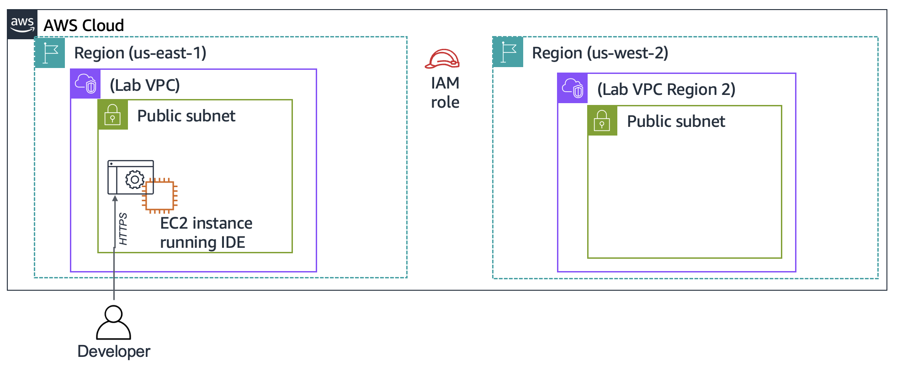

---

## Final Architecture

The final architecture contains a dynamic café website running in the primary AWS Region and a replicated production environment in a secondary AWS Region.

The application uses **AWS Secrets Manager** for secure configuration, while an **AMI** is used to duplicate the configured EC2 environment.

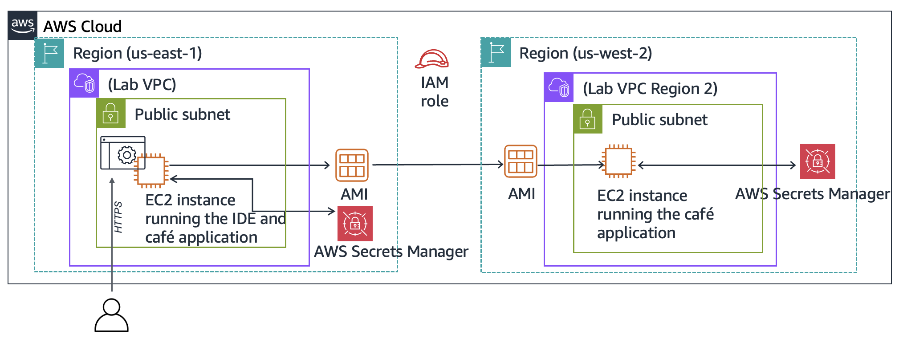

---

# 🪜 Lab Steps

## 1. 🔍 Analyze the Existing EC2 Instance

The pre-provisioned `Lab IDE` EC2 instance was inspected before starting the application deployment.

The purpose was to verify its networking, public accessibility, security configuration, and IAM role.

| Feature | Status / Detail |
| :--- | :--- |
| **Instance Name** | `Lab IDE` |
| **Public Subnet** | Yes |
| **Public IPv4 Address** | Assigned |
| **Open TCP Ports** | `80` |
| **IAM Role** | `VSCodeInstanceRole` |


---

# 2. 💻 Connect to the VS Code IDE

The browser-based **VS Code IDE** was accessed using the `LabIDEURL` and `LabIDEPassword` provided by the lab environment.

The IDE provides:

- 📁 A file browser for `/home/ec2-user/environment`
- 💻 A Bash terminal
- 📝 A code editor
- 🛠️ A development workspace directly connected to the EC2 instance


---

# 3. ⚙️ Configure the LAMP Stack and Test the Web Server

The EC2 environment was configured to support the café's dynamic web application.

The environment consists of:

- **Amazon Linux**
- **Apache HTTP Server**
- **PHP**
- **MariaDB**

---

## 🖥️ 3.1 Verify the Operating System

The operating system was verified using:

```bash
cat /proc/version
```

The output confirms that the EC2 instance is running **Amazon Linux**.
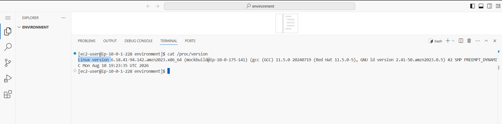
---

## 🌐 3.2 Configure Apache

The VS Code IDE uses port `80`, so Apache was moved to port `8000` to avoid a port conflict.

### Change Apache Port

```bash
sudo sed -i 's/Listen 80/Listen 8000/g' /etc/httpd/conf/httpd.conf
```

### Start Apache

```bash
sudo systemctl start httpd
```

### Enable Apache at Boot

```bash
sudo systemctl enable httpd
```

### Check Apache Status

```bash
sudo service httpd status
```

Apache is configured to run on:

```text
Port 8000
```

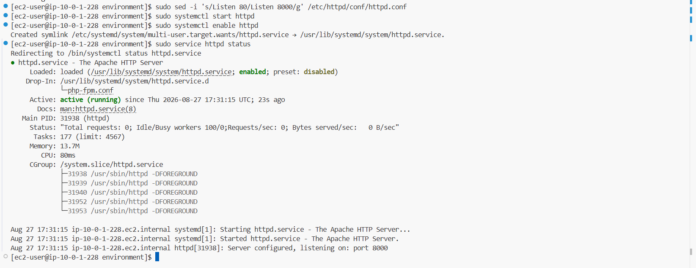
---

## 🐘 3.3 Verify PHP

PHP was already installed on the EC2 instance.

The installed version was verified using:

```bash
php --version
```
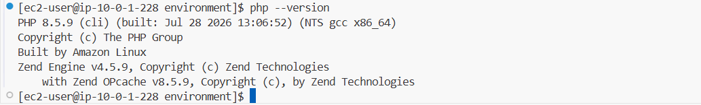
---

## 🗄️ 3.4 Install and Configure MariaDB

MariaDB was installed as the relational database used by the café application.

### Install MariaDB   

```bash
sudo dnf install -y mariadb105-server
```
Wait for the download to complete; be patient🙌
### Start MariaDB

```bash
sudo systemctl start mariadb
```

### Enable MariaDB at Boot

```bash
sudo systemctl enable mariadb
```

### Verify MariaDB Version

```bash
sudo mariadb --version
```

### Check MariaDB Status

```bash
sudo service mariadb status
```
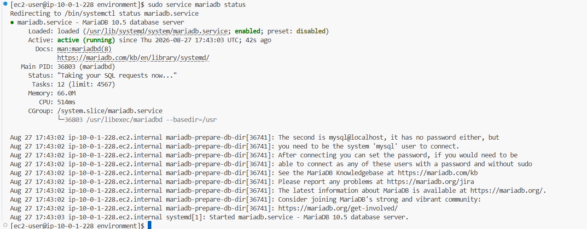
> **Note:** Press `Q` to exit the status screen if necessary.

---

## 📁 3.5 Configure the VS Code Workspace

A symbolic link was created so that the Apache web directory could be accessed directly from the VS Code file browser.

```bash
ln -s /var/www/ /home/ec2-user/environment
```

The ownership of the Apache HTML directory was then changed to `ec2-user`:

```bash
sudo chown ec2-user:ec2-user /var/www/html
```

The web files became accessible through the VS Code file browser under:

```text
CafeWebServer > www > html
```

---

## 📝 3.6 Create a Test Web Page

A simple `index.html` file was created inside:

```text
/var/www/html/
```

The file contains:

```html
<html>Hello from the café web server!</html>
```
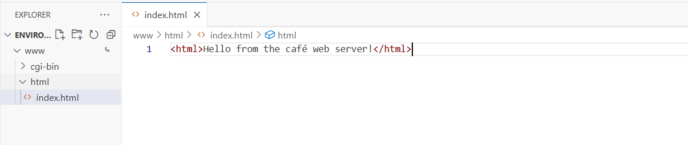
---

## 🛡️ 3.7 Configure the Security Group

The EC2 Security Group was updated to allow inbound traffic to Apache on port `8000`.

| Type | Protocol | Port | Source |
| :--- | :--- | :--- | :--- |
| Custom TCP | TCP | `8000` | `0.0.0.0/0` |

This allows the web server to receive HTTP traffic from the internet.
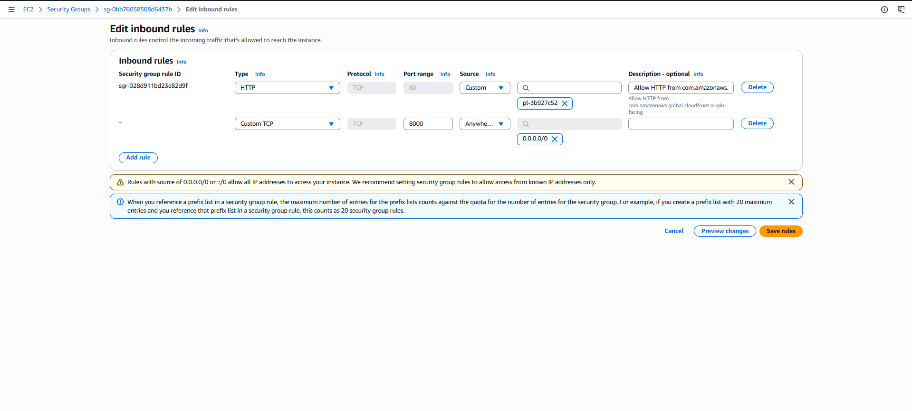

---

## 🌐 3.8 Test Web Server Accessibility

The web server was tested using the EC2 instance's Public IPv4 address:

```text
http://<PUBLIC-IP>:8000
```

The following message was successfully displayed:

```text
Hello from the café web server!
```
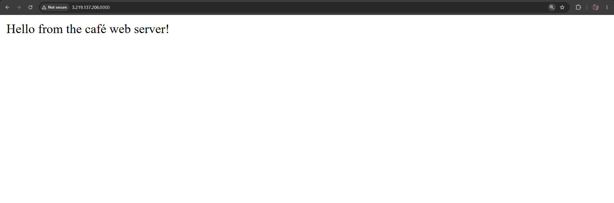
This confirmed that:

- ✅ Apache is running.
- ✅ Apache is listening on port `8000`.
- ✅ The Security Group allows inbound traffic on port `8000`.
- ✅ The EC2 instance is publicly accessible.
- ✅ The web server is serving files correctly.

---

# 4. ☕ Install and Configure the Café Web Application

After confirming that the basic web server works, the dynamic café application was installed.

The application uses:

- **Apache** as the web server.
- **PHP** for dynamic application logic.
- **MariaDB** for storing application data.
- **AWS Secrets Manager** for sensitive configuration.
- **AWS SDK for PHP** to communicate with AWS services.

---

## 📥 4.1 Download the Application Files

Move to the development workspace:

```bash
cd ~/environment
```

Download the setup files:

```bash
wget https://aws-tc-largeobjects.s3.us-west-2.amazonaws.com/CUR-TF-200-ACACAD-3-113230/03-lab-mod5-challenge-EC2/s3/setup.zip
```

Extract them:

```bash
unzip setup.zip
```

Download the database files:

```bash
wget https://aws-tc-largeobjects.s3.us-west-2.amazonaws.com/CUR-TF-200-ACACAD-3-113230/03-lab-mod5-challenge-EC2/s3/db.zip
```

Extract them:

```bash
unzip db.zip
```

Download the café application:

```bash
wget https://aws-tc-largeobjects.s3.us-west-2.amazonaws.com/CUR-TF-200-ACACAD-3-113230/03-lab-mod5-challenge-EC2/s3/cafe.zip
```

Extract the application into the Apache web directory:

```bash
unzip cafe.zip -d /var/www/html/
```
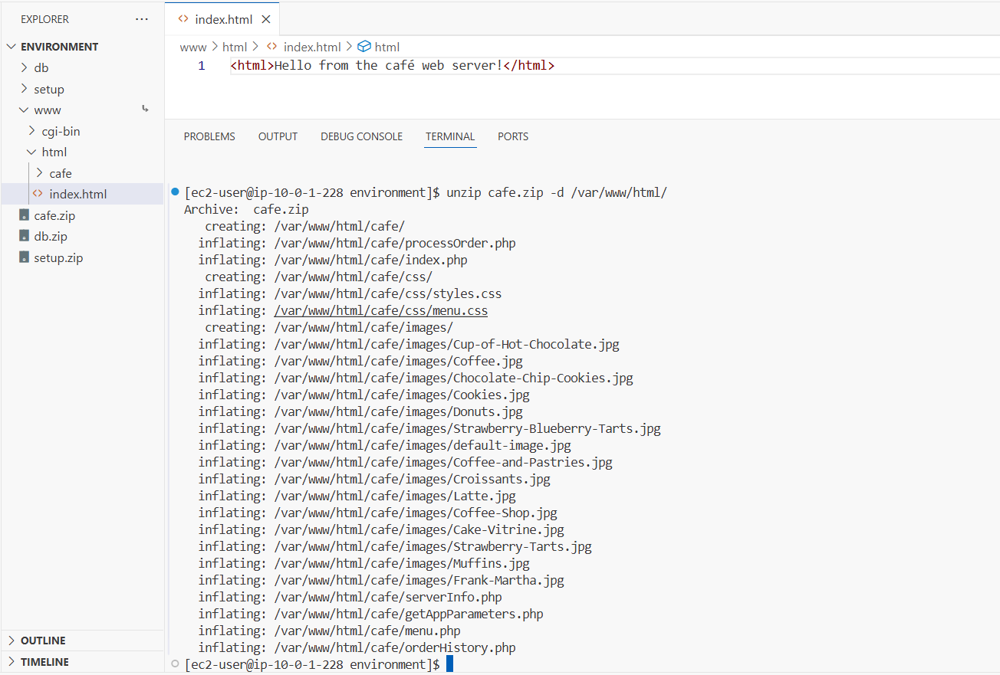
---

## 📦 4.2 Install AWS SDK for PHP

Move into the café application directory:

```bash
cd /var/www/html/cafe/
```

Download the AWS SDK:

```bash
wget https://docs.aws.amazon.com/aws-sdk-php/v3/download/aws.zip
```

```bash
wget https://docs.aws.amazon.com/aws-sdk-php/v3/download/aws.phar
```

Extract the SDK:

```bash
unzip aws -d /var/www/html/cafe/
```

Update the application file permissions:

```bash
chmod -R +r /var/www/html/cafe/
```

---

## 🔐 4.3 Integrate AWS Secrets Manager

The PHP application uses the **AWS SDK for PHP** to communicate with AWS Secrets Manager.

The application retrieves configuration parameters from Secrets Manager instead of storing sensitive values directly inside the PHP source code.

The application contains a file named:

```text
getAppParameters.php
```

This file uses the AWS SDK to retrieve the required application parameters from Secrets Manager.

---

## 🔑 4.4 Create the Application Secrets

Move to the setup directory:

```bash
cd
```
```bash
cd environment/setup/
```

Run the provided script:

```bash
./set-app-parameters.sh
```

The script uses AWS CLI commands to create the required application parameters in **AWS Secrets Manager**.

Seven secrets are created for the café application.
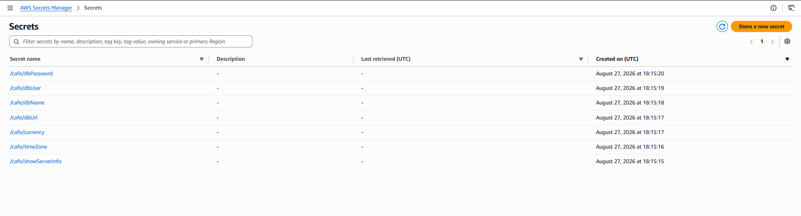
---

## 🔍 4.5 Retrieve the Database Password

From the AWS Console:

```text
AWS Console
→ Secrets Manager
→ Secrets
```

Locate:

```text
/cafe/dbPassword
```

Choose:

```text
Retrieve secret value
```

Copy the generated password.

This value will be used to connect to the MariaDB database.
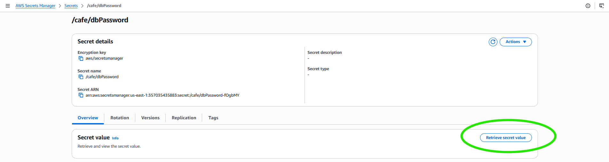
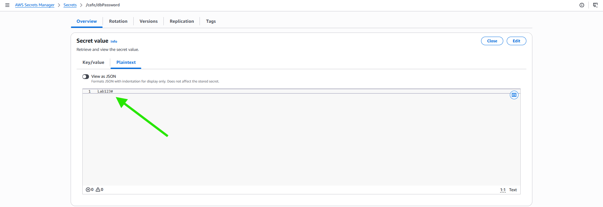

---

# 🗄️ 4.6 Initialize the Café Database

Move to the database directory:

```bash
cd ../db/
```

Set the database root password:

```bash
./set-root-password.sh
```

Create the café database and its tables:

```bash
./create-db.sh
```
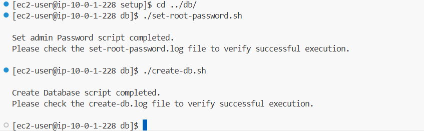
---

## 🔌 4.7 Connect to MariaDB

Connect using the application database user:

```bash
mysql -u admin -p
```

When prompted for the password, enter the value retrieved from:

```text
/cafe/dbPassword
```

A successful connection displays:

```text
mysql>
```
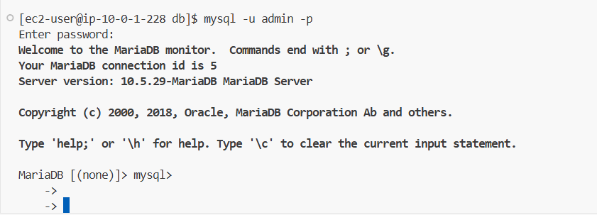
---

## 🔎 4.8 Verify the Database

List all databases:

```sql
show databases;
```

Select the café database:

```sql
use cafe_db;
```

List the tables:

```sql
show tables;
```

Display the products:

```sql
select * from product;
```

Exit the MariaDB client:

```sql
exit;
```

The `product` table contains the menu items used by the café application.

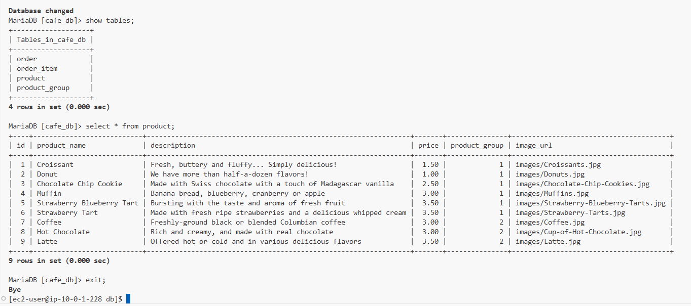
---

# ⏱️ 4.9 Configure the PHP Time Zone

Configure PHP to use the required time zone:

```bash
sudo sed -i "2i date.timezone = \"America/New_York\" " /etc/php.ini
```

Restart Apache to apply the configuration:

```bash
sudo service httpd restart
```

---

# 🌐 4.10 Test the Dynamic Café Website

Open:

```text
http://<PUBLIC-IP>:8000/cafe
```

At this point, the café website should load.

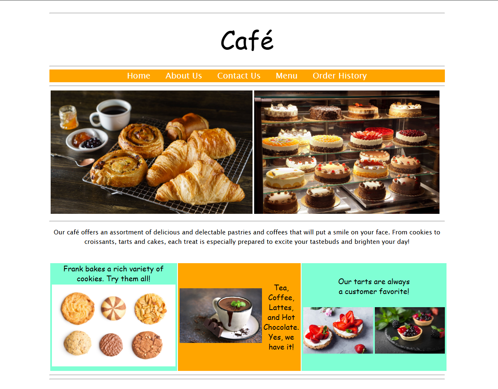
The application may initially load without displaying the menu items. This is related to the permissions required by the application to access AWS Secrets Manager.

---

# 🔐 4.11 Resolve the IAM Permissions Issue

The application needs permission to retrieve its secrets from AWS Secrets Manager.

The required permissions are provided through an IAM Role named:

```text
CafeRole
```

The issue occurs when the EC2 instance does not have the required role attached.
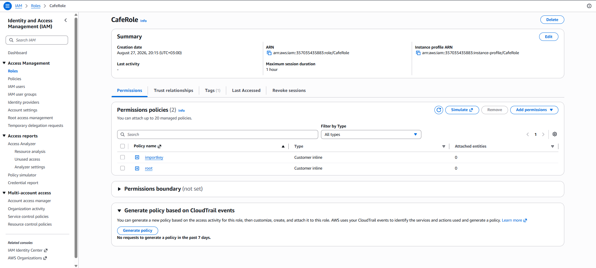
No Role Attached
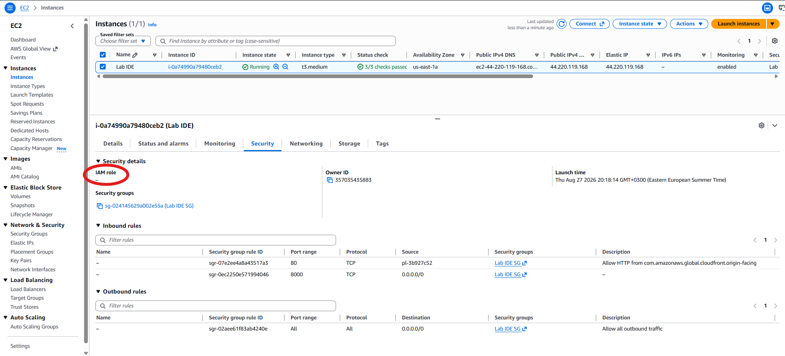
### Solution

From the AWS Console:

```text
EC2
→ Instances
→ Lab IDE
→ Actions
→ Security
→ Modify IAM role
```

Select:

```text
CafeRole
```
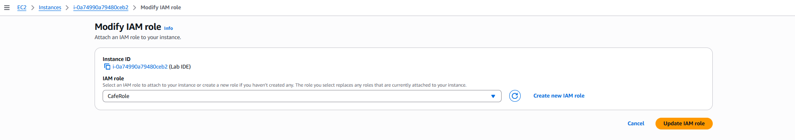
Then update the IAM role.

After attaching the role, the EC2 instance can access the required Secrets Manager resources.

Reload:

```text
http://<PUBLIC-IP>:8000/cafe
```

The café menu should now load successfully.
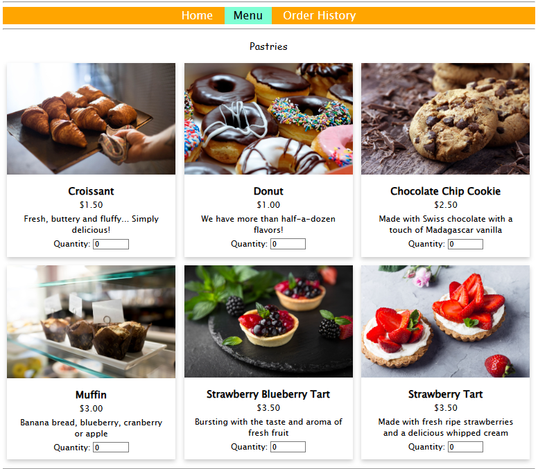
---

# 5. 🧪 Test the Web Application

After resolving the IAM permissions, the dynamic website was tested from the perspective of a customer.

---

## 🛒 5.1 Place an Order

Navigate to:

```text
Menu
```

Select at least one menu item and submit the order.

If necessary, scroll down to find:

```text
Submit Order
```
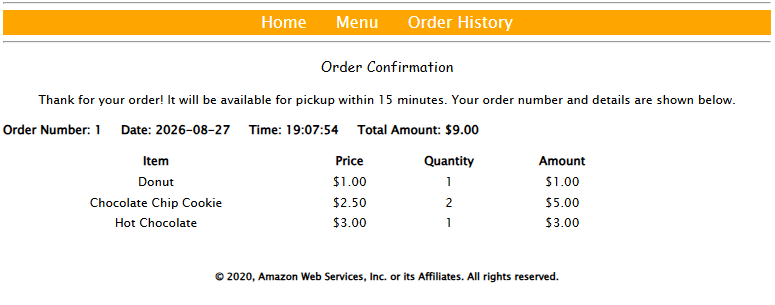
---

## 🛒 5.2 Place a Second Order

Return to the Menu page and place another order.

---

## 📋 5.3 Verify Order History

Navigate to:

```text
Order History
```

The previously submitted orders should be displayed.

This confirms that the application can:

- Display menu items.
- Accept customer orders.
- Store order information in MariaDB.
- Retrieve and display order history.
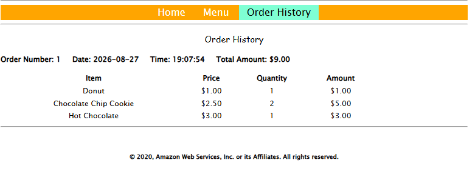
---

# 6. 🖼️ Create an AMI

After successfully configuring and testing the development environment, the next requirement is to duplicate the environment.

Instead of manually reinstalling the entire application, an **Amazon Machine Image (AMI)** is created from the configured EC2 instance.

The AMI contains the configured server environment and allows another EC2 instance to be launched with the same setup.

---

## 🔑 6.1 Prepare the EC2 Instance

Before creating the AMI, configure a static internal hostname:

```bash
sudo hostname cafeserver
```

---

## 🔐 6.2 Generate an SSH Key Pair

Create a new RSA key pair:

```bash
ssh-keygen -t rsa -f ~/.ssh/id_rsa
```

When prompted for the passphrase, press:

```text
Enter
```

When prompted again to confirm the passphrase, press:

```text
Enter
```

This creates:

```text
~/.ssh/id_rsa
~/.ssh/id_rsa.pub
```

Where:

- `id_rsa` is the private key.
- `id_rsa.pub` is the public key.
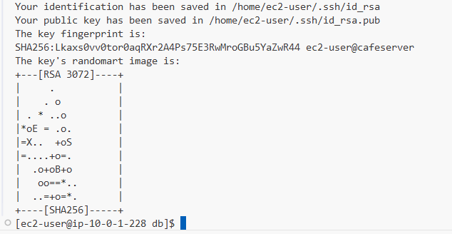
---

## 🔓 6.3 Authorize the New Public Key

Append the public key to the SSH authorized keys:

```bash
cat ~/.ssh/id_rsa.pub >> ~/.ssh/authorized_keys
```

This allows the generated public key to be used for SSH authentication.

---

# 🖼️ 6.4 Create the AMI

From the AWS Console:

```text
EC2
→ Instances
→ Lab IDE
```

Select the fully configured instance.

Then choose:

```text
Actions
→ Images and templates
→ Create image
```
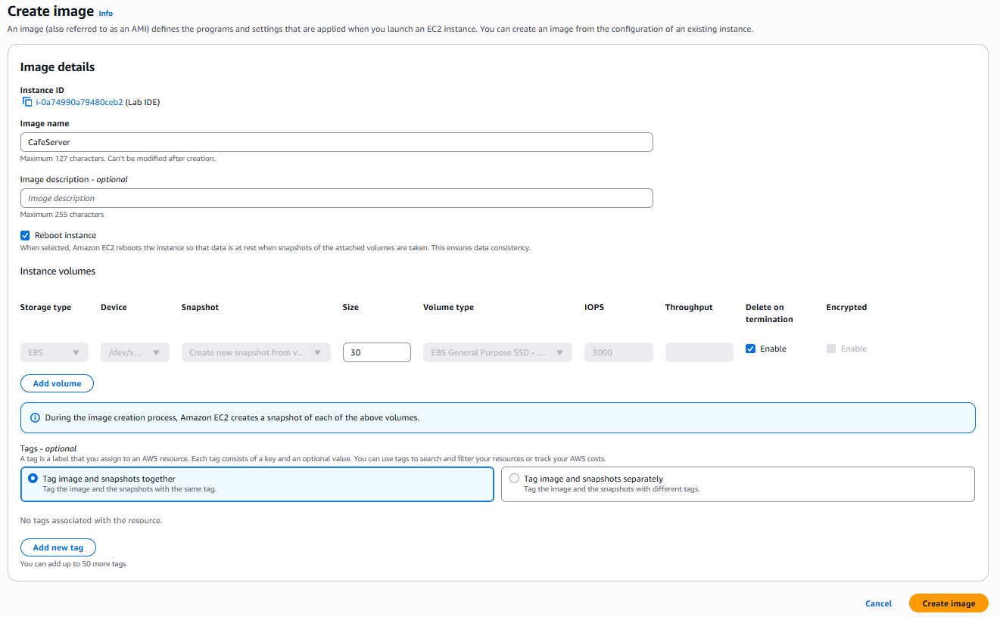
The resulting AMI represents the configured development environment.

---

## 7. Copy AMI to Oregon

AMIs are Regional Resources, so the AMI created in `us-east-1` must be copied to `us-west-2`.

In `us-east-1`:

```text
EC2
→ AMIs
→ Select CafeServer
→ Actions
→ Copy AMI
```

Set the destination Region to:

```text
us-west-2
```

Start the copy.
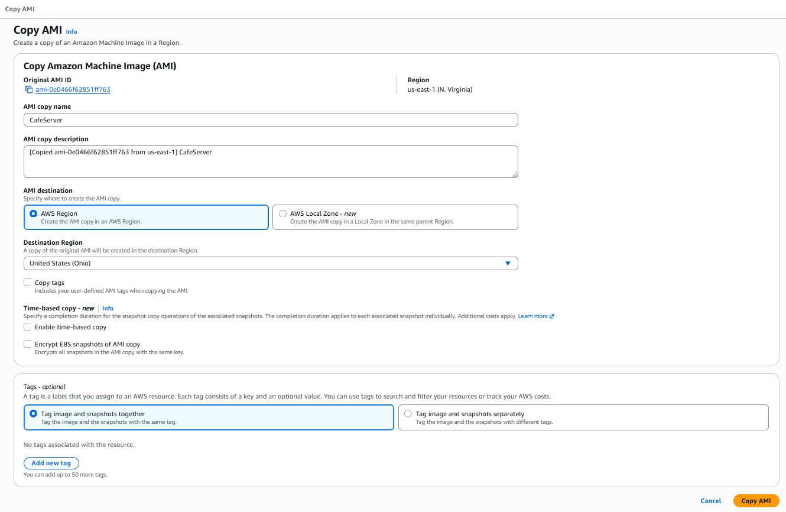
Switch to:

```text
US West (Oregon)
us-west-2
```

Then:

```text
EC2
→ AMIs
```

Wait until the copied AMI becomes:

```text
Available
```

---

## 8. Launch Production EC2

Select the copied `CafeServer` AMI and choose:

```text
Launch instance
```

Configure:

| Setting | Value |
|---|---|
| Name | `ProdCafeServer` |
| Instance Type | `t2.small` |
| Key Pair | `Proceed without a key pair` |
| VPC | `Lab VPC Region 2` |
| Subnet | `Public Subnet` |
| Security Group | `cafeSG` |
| IAM Instance Profile | `CafeRole` |

Security Group rules:

| Protocol | Port | Source |
|---|---:|---|
| TCP | `22` | `0.0.0.0/0` |
| TCP | `8000` | `0.0.0.0/0` |

Choose:

```text
Launch instance
```

---

## 9. Get Production DNS

Open:

```text
EC2
→ Instances
→ ProdCafeServer
```

Copy the:

```text
Public IPv4 DNS
```

---

## 10. Configure Production Secrets

Return to the VS Code IDE in `us-east-1`.

Open:

```text
CafeWebServer/setup/set-app-parameters.sh
```

Change the Region:

```text
region="us-west-2"
```

Change the Production DNS:

```text
publicDNS="<Public-DNS-of-ProdCafeServer>"
```

Save the file.

---

## 11. Run the Parameters Script

In the VS Code terminal:

```text
cd ~/environment/setup/
```

Then:

```text
./set-app-parameters.sh
```

This creates the required Secrets Manager parameters in `us-west-2`.

---

## 12. Verify Production Server

In the Oregon Region, open:

```text
EC2
→ Instances
→ ProdCafeServer
```

Copy its:

```text
Public IPv4 address
```

Open:

```text
http://<public-ip>:8000
```

Expected result:

```text
Hello from the cafe web server!
```

---

## 13. Test the Café Application

Open:

```text
http://<public-ip>:8000/cafe/
```

Verify:

```text
Café Website
→ Menu
→ Select an item
→ Submit Order
→ Order History
```

The Menu and ordering functionality should work correctly.

---

## 14. Optional SSH Troubleshooting

From the VS Code IDE in `us-east-1`:

```text
ssh -i ~/.ssh/id_rsa ec2-user@<public-ip-of-ProdCafeServer>
```

---

## 15. Final Architecture

```text
Development Environment
us-east-1
Lab IDE
    ↓
CafeServer AMI
    ↓
Copy AMI
    ↓
Production Environment
us-west-2
ProdCafeServer
```

### Development

```text
Region: us-east-1
Instance: Lab IDE
```

### Production

```text
Region: us-west-2
Instance: ProdCafeServer
```

### AWS Services

```text
EC2
AMI
VPC
IAM
Secrets Manager
Apache
PHP
MariaDB
```