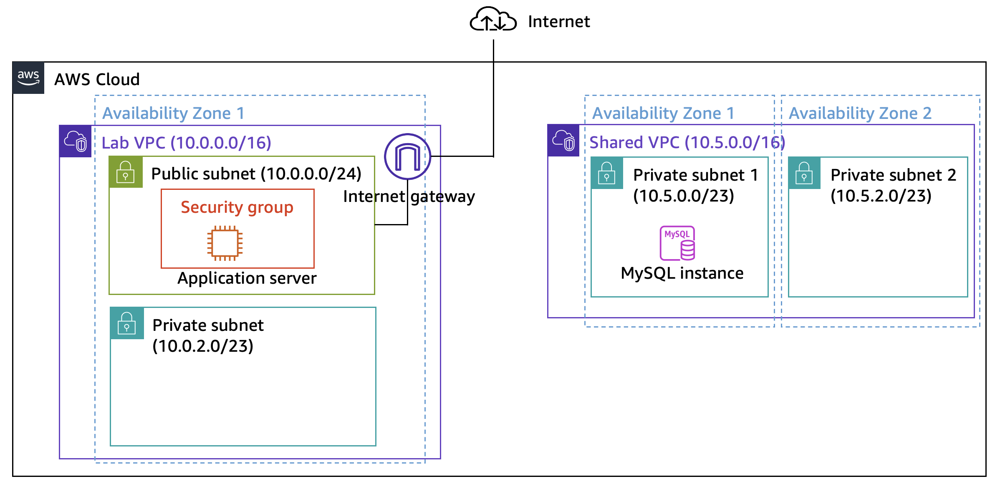
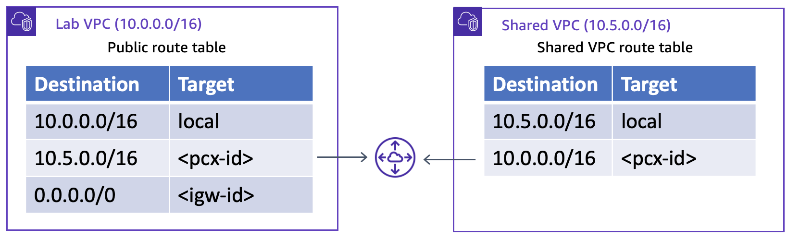
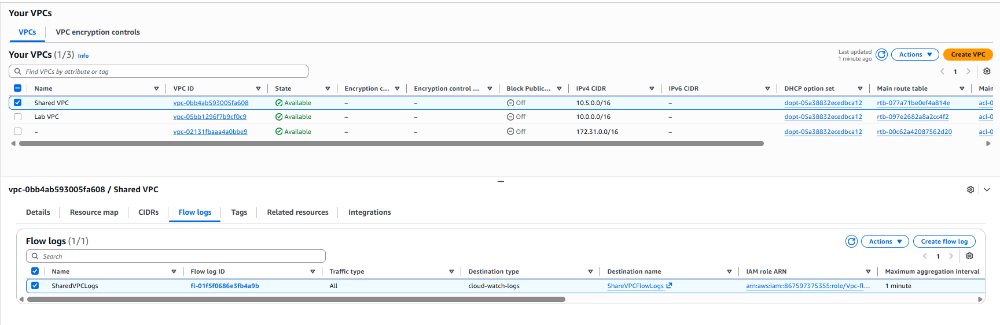
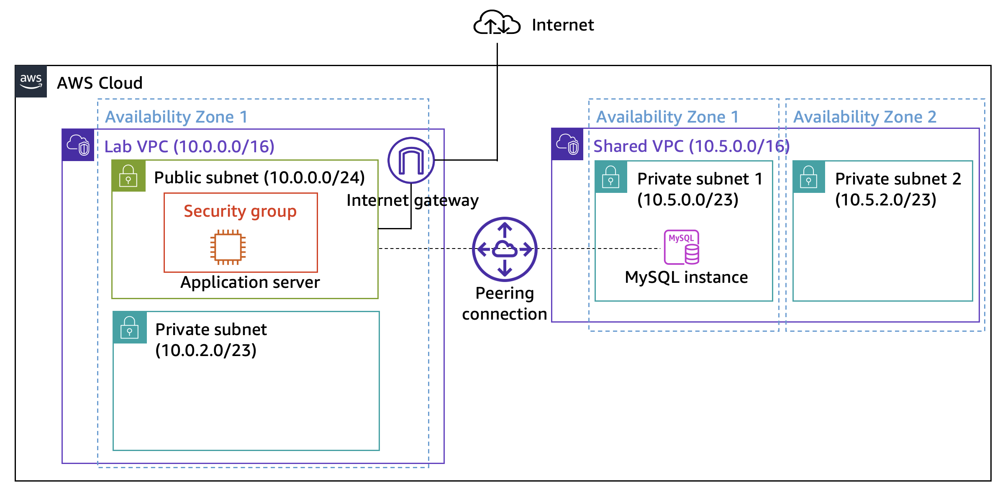

# 🚀 Creating a VPC Peering Connection

In this lab, we are solving a common cloud networking problem: securely connecting two isolated environments. 

We have a public-facing Application Server located in a `Lab VPC`, and we need it to communicate with a MySQL database located in a `Shared VPC`. By default, AWS VPCs are completely isolated from each other. We want to establish a secure, private communication path between them without putting the database on the internet or attaching an Internet Gateway to the database's VPC.

Here is what our starting architecture looks like. Notice how the two networks (`10.0.0.0/16` and `10.5.0.0/16`) are separate entities with no bridge between them.

---

### 1. Establishing the VPC Peering Connection

To fix this network isolation, the first thing we need to do is physically bridge the two networks. We will do this by creating a **VPC Peering Connection**. 

Think of VPC Peering as a virtual networking cable plugged directly between the two VPCs. The traffic routes privately over the internal AWS global backbone, meaning it never touches the public internet.

The process requires a request and an acceptance. We are going to initiate the connection from the Lab VPC and target the Shared VPC.

| Setting | Value |
|---|---|
| Name | `Lab-Peer` |
| Requester | `vpc-05bb1296f7b9cf0c9` (Lab VPC) |
| Accepter | `vpc-0bb4ab593005fa608` (Shared VPC) |

> 📸 Here we create the connection named `Lab-Peer` using the two non-overlapping CIDR blocks.

Once requested, the connection does not immediately activate. It goes into a pending state. AWS does this for security: cross-account or cross-VPC connections always require explicit authorization from the target network's owner to prevent unauthorized access.

> 📸 This shows the connection request securely waiting for approval from the Shared VPC side.

Now we need to explicitly accept the request. This finalizes the security handshake and allows AWS to provision the virtual bridge.

> 📸 Accepting the request authorizes the actual network link to be created.

> 💡 **Important Insight:** Seeing `Active` on a Peering Connection simply means the physical link is successfully established. It does **not** automatically mean traffic can flow. AWS routers drop traffic unless told exactly where to send it.

> 📸 This confirms the peering connection (`pcx-078e41aa1fa45bd3e`) is now `Active`.

The networks are now physically linked. However, if the application tried to query the database right now, the local VPC router would look at the packet, realize it doesn't know where the `10.5.0.x` network is, and immediately drop it. 

We need to teach the routers how to use this new bridge.

---

### 2. Configuring the Route Tables

Now that the peering connection is active, we must update the Route Tables. The Route Table is the brain of the VPC network; it tells the router exactly where to send packets based on their destination IP address.

We are going to add a static route in both VPCs. 
- The `Lab VPC` needs a rule saying: "If you see traffic heading for `10.5.0.0/16`, send it into the Peering Connection."
- The `Shared VPC` needs a rule saying: "If you see traffic heading for `10.0.0.0/16`, send it into the Peering Connection."

> 🎯 **Focus here:** This is a highly critical step. The peering connection is just the physical path; the Route Table is what actually forces the traffic to take that path. Both sides must be configured.

> 📸 This diagram shows exactly what we need to build: bidirectional routes pointing to the `<pcx-id>` (Peering Connection ID).

First, we will update the Lab VPC. This allows the application server to successfully send query packets out of its own network and toward the database.

> 📸 Here we add the `10.5.0.0/16` destination route and point it to the Peering Connection target.

Next, we must configure the return route in the Shared VPC. 

> ⚠️ **Watch out:** A very common mistake in cloud networking is forgetting the return route. If we skip this, the application's request will successfully reach the database, but when the database tries to reply, its local router won't know where `10.0.x.x` is and will drop the response (this is known as asymmetric routing failure).

> 📸 Here we add the return route (`10.0.0.0/16`) to the Shared VPC so the database can reply.

Finally, we can verify that the AWS routing engine has accepted our new rules.

> 📸 This confirms the route is `Active` and fully propagated in the network.

#### 🌐 Network Traffic Flow

With these routes in place, both VPCs know exactly how to reach each other. The network path is now complete and functional:

**Outbound Request (Application to Database):**
Application EC2 (`10.0.0.x`) → Lab Route Table (Matches `10.5.0.0/16`) → Peering Connection (`pcx-...`) → Shared VPC → MySQL Database.

**Inbound Response (Database back to Application):**
MySQL Database (`10.5.0.x`) → Shared Route Table (Matches `10.0.0.0/16`) → Peering Connection (`pcx-...`) → Lab VPC → Application EC2.

---

### 3. Enabling VPC Flow Logs for Visibility

Now that our routing is configured, traffic should technically be able to flow between the VPCs. But as Cloud Engineers, we shouldn't just guess that it works—we need visibility. If a Security Group or Network ACL blocks the traffic later on, we need a way to see exactly what is happening at the network interface level.

To get this visibility, we are going to enable **VPC Flow Logs** on the `Shared VPC`. This feature captures information about the IP traffic entering and leaving the VPC.

We will configure the Flow Log to capture *All* traffic (both accepted and rejected packets) with a fast 1-minute aggregation interval. We will send these records directly to CloudWatch Logs so we can analyze them easily.

| Setting | Value |
|---|---|
| Target Resource | `Shared VPC` (`vpc-0bb4ab593005fa608`) |
| Name | `SharedVPCLogs` |
| Filter | `All` |
| Aggregation Interval | `1 minute` |
| Destination | CloudWatch Logs |
| Log Group | `ShareVPCFlowLogs` |

> 📸 Here we configure the Flow Log for the Shared VPC, ensuring it captures all traffic and routes it to CloudWatch.

After creating the Flow Log, we can verify it was successfully attached by checking the VPC settings. 

> 📸 This confirms that the `SharedVPCLogs` flow log is securely attached to the Shared VPC and actively pointing to our CloudWatch destination.

With this enabled, every single packet attempting to enter or leave the database network is now being recorded. 

---

### 4. Testing the Application Connectivity

It is time for the final test. We have physically linked the networks, configured the routing, and enabled logging. Now we need to see if the application in the Lab VPC can actually talk to the database in the Shared VPC.

First, we access the application's web interface using the EC2 instance's public IP address. As expected, the web server loads, but it warns us that it cannot connect to the database yet.

> 📸 This shows the application is running but does not yet know where the database is located.

To fix this, we need to provide the application with the database credentials and endpoint. We will go to the Settings page and enter the private RDS endpoint located in the Shared VPC. 

🎯 **Pay attention:** We are using the *private* DNS endpoint of the database (`inventory-db...rds.amazonaws.com`). This is the ultimate proof of our architecture. Because of our VPC Peering and route tables, the application will be able to resolve and reach this private address over the AWS backbone.

> 📸 Here we point the application directly to the private RDS endpoint over our peered network.

After saving the settings, the application attempts to connect. If our network path is correct, it will retrieve the data.

> 📸 This confirms complete success. The application successfully loaded the inventory data from the database.

---

### 5. Analyzing the VPC Flow Logs

We know the application works because the web page loaded the data. But as cloud engineers, we need to know how to verify this traffic at the network level. We will use the Flow Logs we set up earlier to prove that the traffic took the path we expected.

First, we navigate to the CloudWatch console and open the log group we specified during the Flow Log creation.

> 📸 Here we locate the `ShareVPCFlowLogs` group where our VPC is sending network data.

Inside the log group, data is organized into Log Streams. AWS creates a separate log stream for every Elastic Network Interface (ENI). We will click on the stream that represents the network interface of our database.

> 📸 Selecting the specific ENI log stream for our Shared VPC resources.

Now we can see the raw network packets. 

🎯 **What to look for:** We are looking for traffic originating from the Lab VPC CIDR (`10.0.x.x`) trying to reach the Shared VPC CIDR (`10.5.x.x`) on the database port (`3306`). We also want to confirm the action says `ACCEPT OK`, which proves the Security Group allowed the connection.

> 📸 This is the ultimate proof. We can clearly see bidirectional traffic between `10.0.0.131` (App) and `10.5.2.171` (DB) on port `3306` with an `ACCEPT OK` status.

---

## 🏗️ Final Architecture & Outcome

By the end of this lab, we successfully transformed two isolated environments into a unified, secure architecture.

**What we achieved:**
1.  **Connectivity:** We created a private AWS backbone link between `10.0.0.0/16` and `10.5.0.0/16` using VPC Peering.
2.  **Routing:** We updated both VPC route tables to ensure bidirectional communication was possible.
3.  **Visibility:** We enabled VPC Flow Logs and verified our traffic in CloudWatch.
4.  **Validation:** We successfully connected a public-facing application to a strictly private database without exposing the database to the internet.

## 🎓 Final Takeaways

*   **Explicit Routing is Mandatory:** AWS networking does not assume intent. Connecting two networks physically (via peering) is useless without explicitly updating the Route Tables to direct packets to the new target.
*   **Symmetrical Routing:** Traffic always requires a return path. A common error in cloud networking is establishing the outbound route but forgetting to update the destination's route table to handle the return traffic.
*   **Security by Design:** By leveraging VPC Peering instead of public IPs, we maintained a zero-trust external posture for the database tier. It remains completely invisible to the public internet while remaining fully accessible to our authorized internal application.