# Guided Lab: Creating a VPC

Build a custom Virtual Private Cloud (VPC) from scratch to securely host and expose an application server.

## 🎯 Objective
* Deploy a custom VPC.
* Create and differentiate between public and private subnets.
* Create an Internet Gateway (IGW) and configure Route Tables.
* Launch an EC2 application server to test public connectivity.

## 🧰 Services Used
* **Amazon VPC** (Networking)
* **Amazon EC2** (Compute)

## 🏗️ Architecture
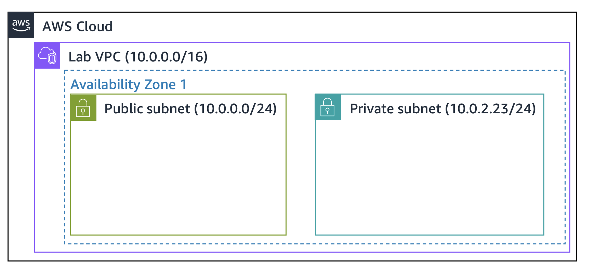
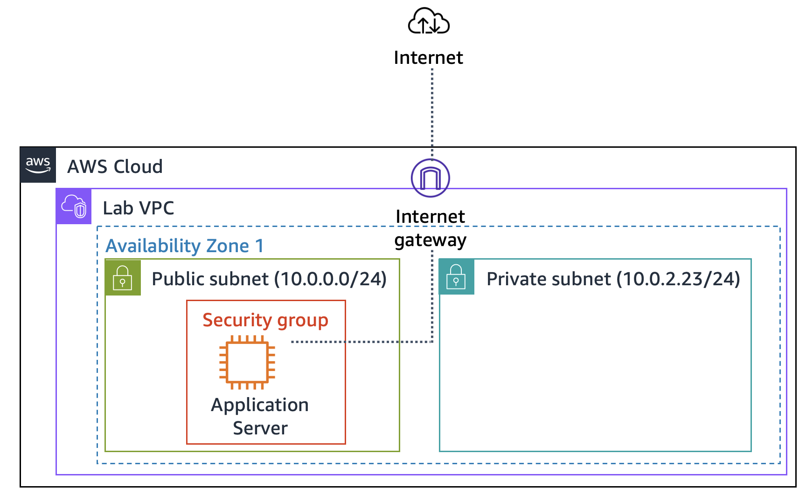

## 🪜 Steps

**1. Create the VPC**
Created a custom VPC named `Lab VPC` with a CIDR block of `10.0.0.0/16` and enabled DNS hostnames.
* *Why?* This creates a logically isolated virtual network boundary. Enabling DNS hostnames ensures our future servers get friendly domain names instead of just raw IP addresses.
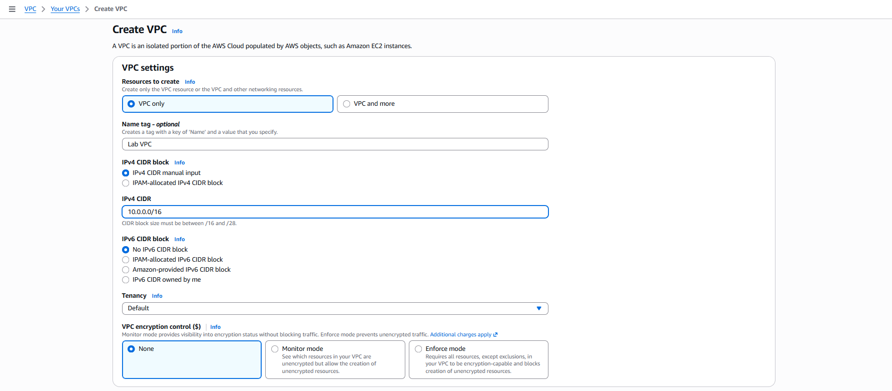
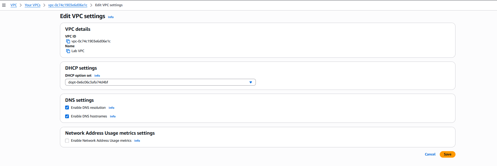

**2. Create Public and Private Subnets**
Divided the VPC into two separate subnets. Enabled "auto-assign public IPv4" specifically for the public subnet.

| Subnet Name | CIDR Block | Auto-assign Public IP | Purpose |
| :--- | :--- | :--- | :--- |
| **Public Subnet** | `10.0.0.0/24` | Yes | For internet-facing resources (e.g., web servers). |
| **Private Subnet** | `10.0.2.0/23` | No | For isolated backend resources (e.g., databases). |

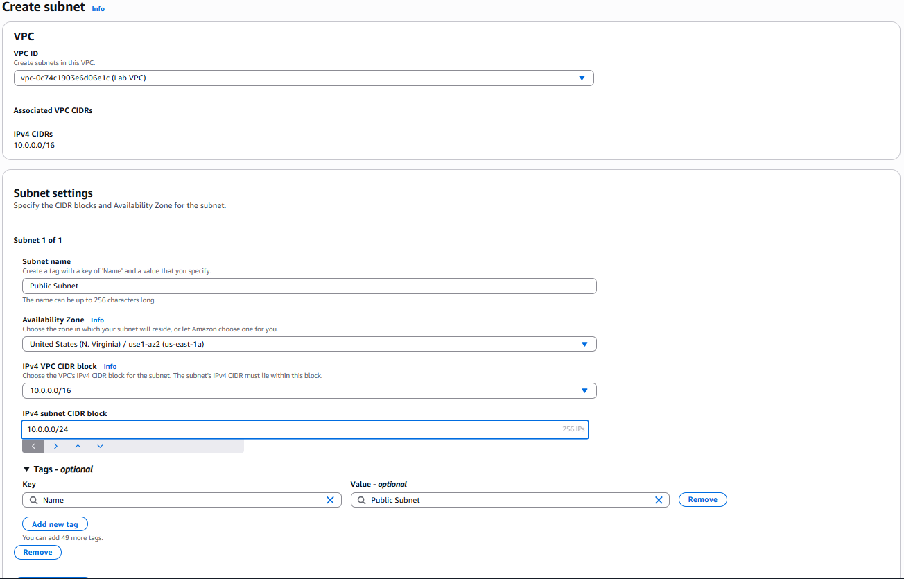
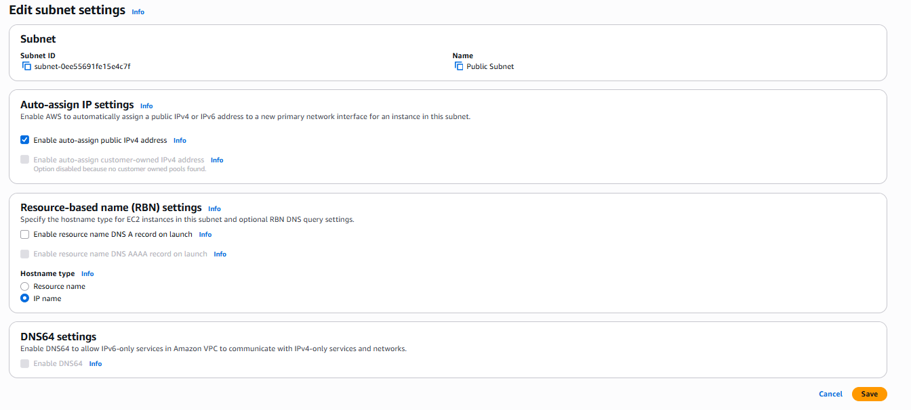

**3. Create and Attach an Internet Gateway (IGW)**
Created an Internet Gateway named `Lab IGW` and attached it to the `Lab VPC`.
* *Why?* An IGW acts as the main "door" that connects the isolated VPC to the outside internet. Without it, the VPC is completely cut off from the web.
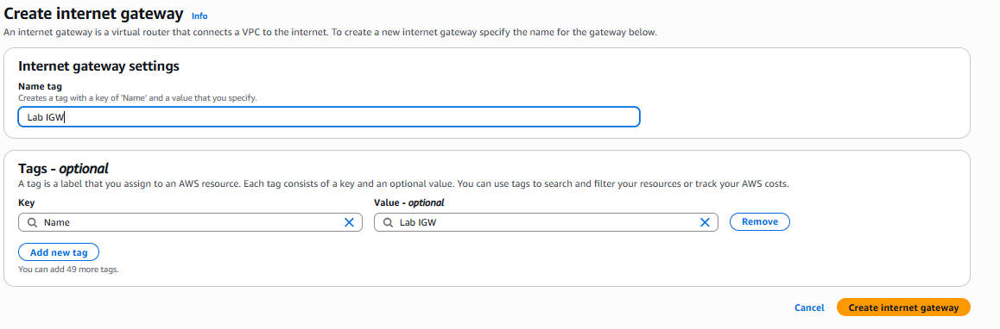
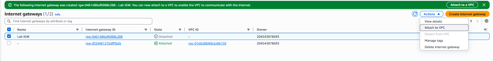
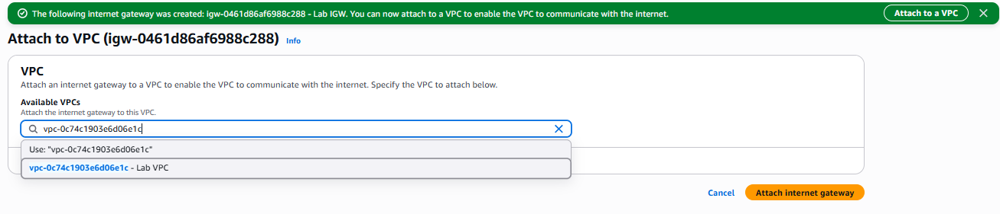

**4. Configure Route Tables**
Renamed the default main route table to `Private Route Table` (which only routes traffic locally). Created a new `Public Route Table`, added a route directing all traffic (`0.0.0.0/0`) to the IGW, and associated it with the Public Subnet.
* *Why?* Subnets need a map to know where to send data. The route table explicitly tells the Public Subnet how to find and use the Internet Gateway door to reach the outside world.
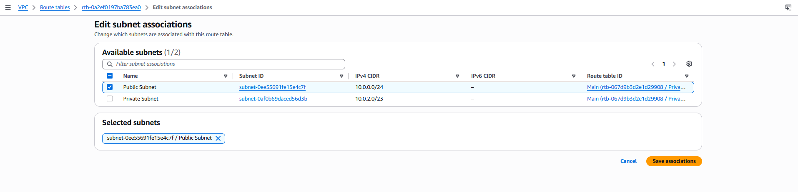

**5. Create a Security Group**
Created a virtual firewall named `App-SG` for the application server.

| Type | Port | Source | Why? |
| :--- | :--- | :--- | :--- |
| HTTP | `80` | `0.0.0.0/0` (Anywhere) | Allows anyone on the internet to view the web application. |

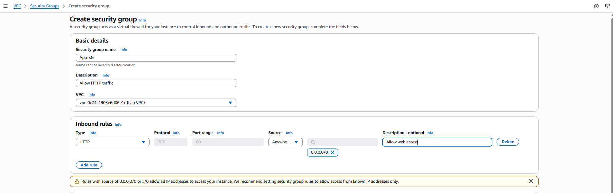

**6. Launch the Application Server**
Launched an Amazon Linux EC2 instance (`App Server`) into the Public Subnet. Attached the `App-SG` security group and the `Inventory-App-Role` IAM profile. Provided a bootstrap script in the User Data to automatically install a web server.
* *Why?* This is the ultimate test of our network setup. If we can reach the web page over the internet using the instance's Public DNS, it proves our VPC, Subnet, IGW, Route Table, and Security Group are all configured correctly.
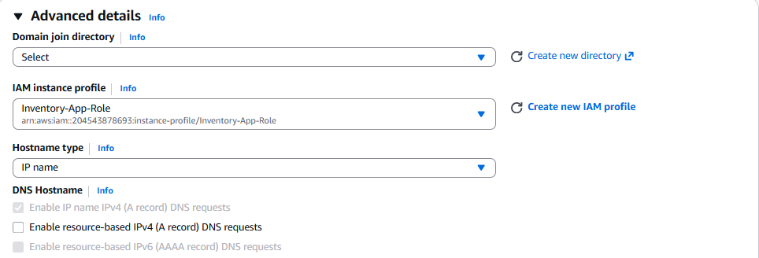

## ✅ Outcome
Successfully built a custom network architecture (VPC) from scratch and verified its external connectivity by deploying a functional, internet-accessible web server.