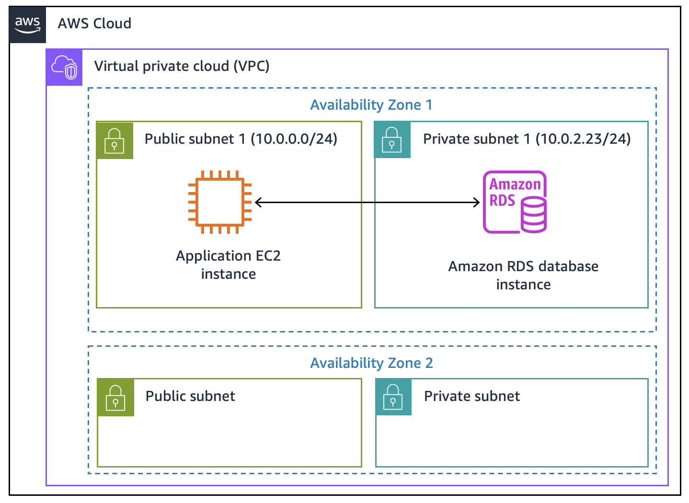
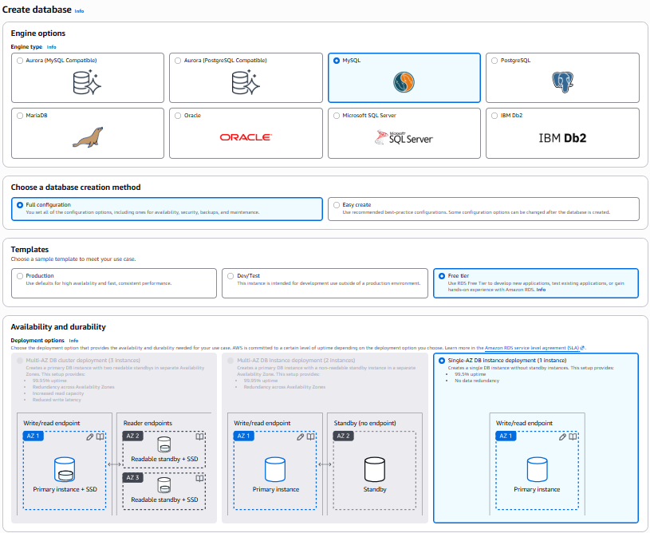
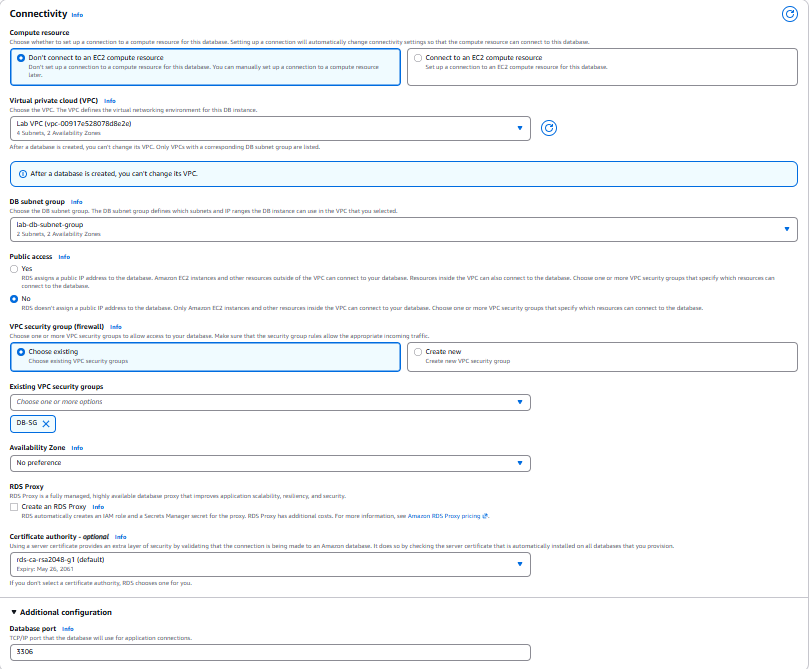
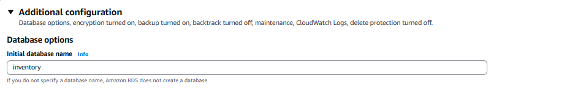
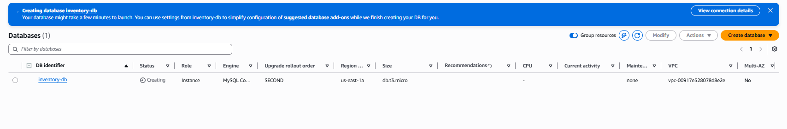
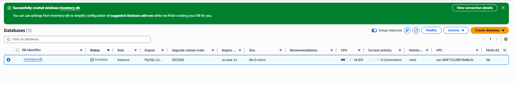
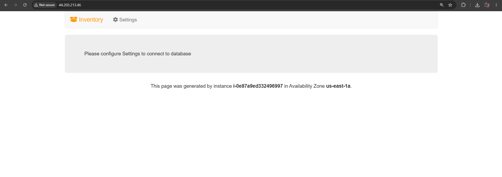
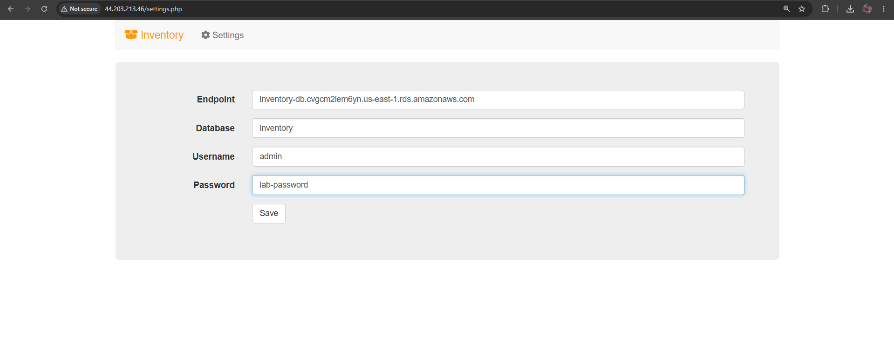
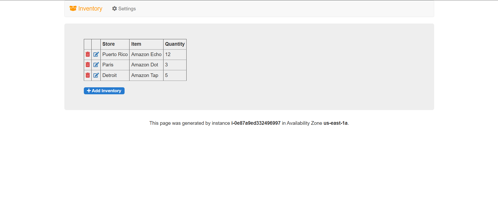
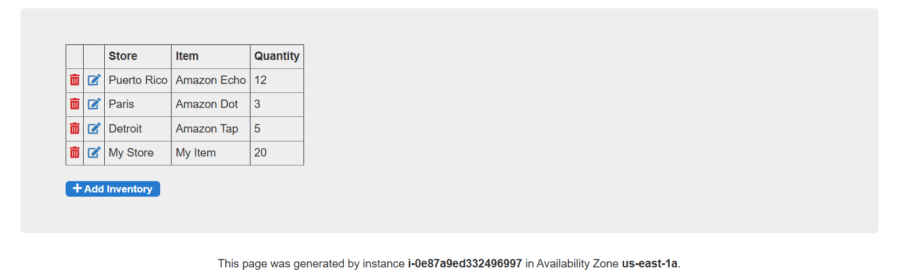

# Amazon RDS Database Creation & Integration

Deploy a managed MySQL database using Amazon RDS and securely connect an existing EC2 web application to it.

## 🎯 Objective
* Create an Amazon RDS MySQL database instance.
* Retrieve the database endpoint for application integration.
* Configure a web application to connect to the database securely.
* Store database credentials securely using AWS Secrets Manager.

## 🧰 Services Used
* **Amazon RDS** — Fully managed relational database service.
* **Amazon EC2** — Hosts the web application.
* **Amazon VPC** — Provides the isolated network environment.
* **AWS Secrets Manager** — Secures and manages database credentials.

## 🏗️ Architecture
The web application runs on an EC2 instance in a public subnet and communicates securely with the Amazon RDS database located in a private subnet.

## 🪜 Steps

**1. Choose the Database Engine and Template**
Created a new database using **MySQL**. 
* *Why?* It is a popular open-source engine with no licensing fees. 
Selected the **Free tier** template to keep it cost-effective for dev/test purposes.

**2. Configure Database Details and Credentials**
Set up the identity and login details for the database instance.
| Setting | Value | Reason |
| :--- | :--- | :--- |
| **DB instance identifier** | `inventory-db` | Uniquely identifies the RDS instance in AWS. |
| **Master username** | `admin` | The primary administrator account for the DB. |
| **Master password** | `lab-password` | Used to authenticate the connection. |

**3. Allocate Compute and Storage**
Configured the hardware resources for the database.
* **Instance Class:** `db.t3.micro` (Burstable, cost-efficient for small workloads).
* **Storage:** 20 GB General Purpose SSD (gp2).
* **Storage Autoscaling:** Disabled to strictly control lab resources.

**4. Set Up Networking and Security**
Configured the network placement and firewall rules.
* *Why?* The database needs to be in the correct Virtual Private Cloud (VPC) and requires a specific Security Group (`DB-SG`) to allow incoming traffic only from the EC2 web application.

**5. Define the Initial Database Name**
Under Additional configuration, set the **Initial database name** to `inventory`. 
* *Why?* This tells RDS to automatically create a logical database inside the MySQL instance so the application can start using it immediately without manual SQL setup.

**6. Launch and Wait for Availability**
Initiated the database creation. The status started as **Creating** and eventually changed to **Available**.

**7. Access the Web Application**
Opened the EC2 instance's public IP in a browser. The app loaded but displayed a prompt to configure settings.
* *Why?* The application logic is running, but it has nowhere to read or write inventory data yet.

**8. Connect the Application to RDS**
Navigated to the application's Settings page and provided the connection details retrieved from the RDS console.
| Setting | Value |
| :--- | :--- |
| **Endpoint** | The unique RDS endpoint URL (e.g., `inventory-db...rds.amazonaws.com`) |
| **Database** | `inventory` |
| **Username** | `admin` |
| **Password** | `lab-password` |

**9. Test Database Integration**
Saved the settings. The application successfully connected to the database, loaded initial data, and allowed new inventory records to be added.

## ✅ Outcome
Successfully provisioned a managed MySQL database in the cloud and securely connected a web application to it using dynamic secrets retrieval.