# AWS EC2 & Data Lifecycle Manager (DLM) Comprehensive Backup Strategy

Automating EC2 instance backups, managing snapshot retention lifecycles, and configuring cross-region snapshot replication for full disaster recovery using Amazon DLM.

## 🎯 Objective
* **Infrastructure:** Provision a custom VPC, Subnet, Internet Gateway, and an EC2 instance.
* **Application:** Deploy an Apache web server with test data.
* **Data Lifecycle Manager (DLM):** Create lifecycle policies using custom IAM roles and resource tagging.
* **Timing & Retention:** Understand and configure UTC schedules and snapshot retention limits.
* **Cross-Region Replication:** Automate copying snapshots to a secondary AWS Region.
* **Disaster Recovery (DR):** Simulate a server failure and successfully restore the web application and its data from an automated snapshot.

## 🧰 Services Used
* **Amazon EC2** — Compute resources and web hosting.
* **Amazon EBS** — Block storage and snapshots.
* **Amazon Data Lifecycle Manager (DLM)** — Automating snapshot lifecycles.
* **AWS IAM** — Secure permissions for DLM operations.
* **Amazon VPC** — Isolated networking environment.

## 🏗️ Architecture
*(Waiting for architecture details...)*

## 🪜 Steps

**1. Create the Virtual Private Cloud (VPC)**
Created the foundational network boundary for the lab. We specifically chose to create the **VPC only** to manually build and understand each networking component step by step.

| Setting | Value | Reason |
| :--- | :--- | :--- |
| **Resources to create** | VPC only | Ensures we manually build Subnets, IGWs, and Route Tables for deeper learning. |
| **Name tag** | `dlm-lab-vpc` | To easily identify our custom lab environment. |
| **IPv4 CIDR block** | `10.0.0.0/16` | Sets the IP address range, providing up to 65,536 private IP addresses. |
| **IPv6 CIDR block** | No IPv6 CIDR block | Not required for this scenario. |
| **Tenancy** | Default | Uses shared AWS hardware, keeping the lab simple and cost-effective. |

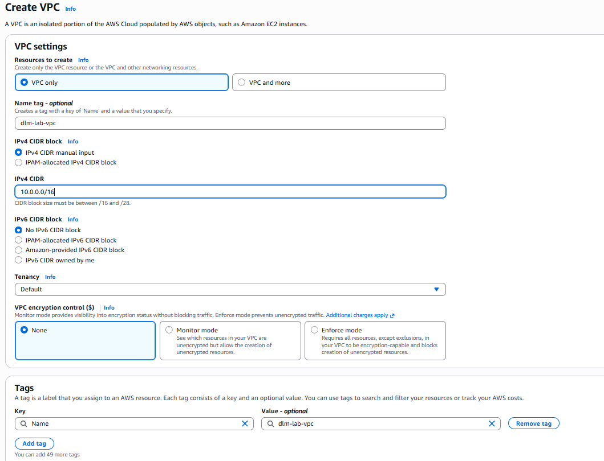

**2. Create a Public Subnet**
Created a single subnet inside our VPC to host the EC2 instance. We placed it in a single Availability Zone (AZ) because high availability across multiple AZs is not the focus of this specific backup and restore lab.

| Setting | Value | Reason |
| :--- | :--- | :--- |
| **VPC** | `dlm-lab-vpc` | Associates the subnet with our custom VPC. |
| **Subnet name** | `dlm-public-subnet` | Identifies the intended use for this subnet. |
| **Availability Zone** | `us-east-1a` | Keeps resources consolidated in one zone. |
| **IPv4 CIDR block** | `10.0.1.0/24` | Allocates a sub-range of 256 IPs, which is more than enough for our EC2 instance. |

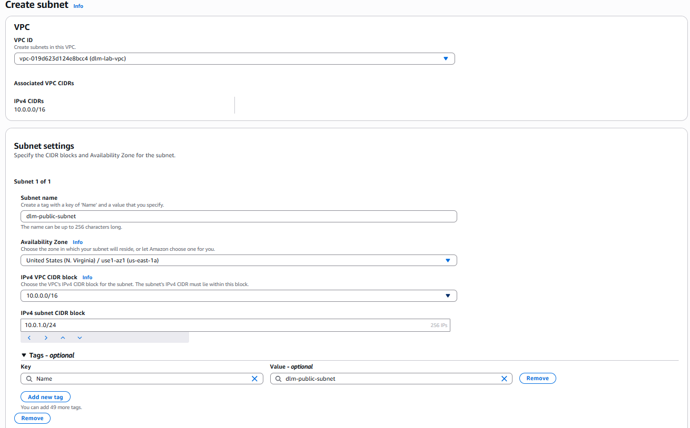
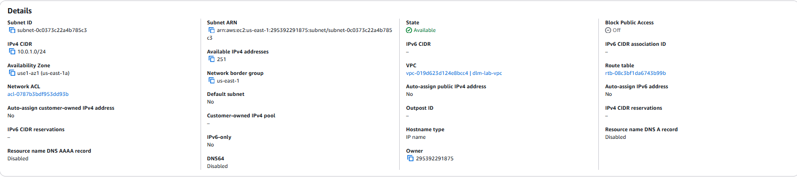

**3. Create and Attach an Internet Gateway (IGW)**
Created a new Internet Gateway to allow communication between our VPC and the internet. Once created, it was explicitly attached to our custom VPC.

| Setting | Value |
| :--- | :--- |
| **Name tag** | `dlm-lab-igw` |
| **Target VPC** | `dlm-lab-vpc` |

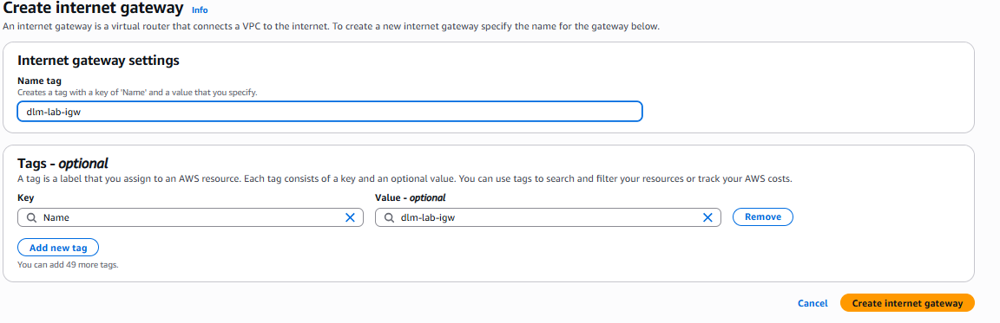
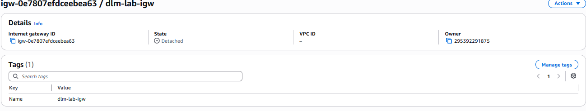
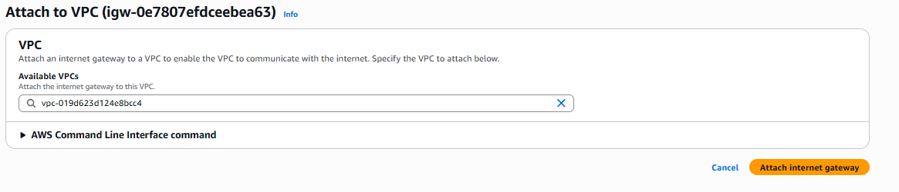
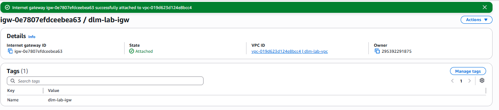

**4. Configure the Route Table**
A Route Table acts as a map for network traffic. We created a custom route table to direct internet-bound traffic out of our VPC using the Internet Gateway.

| Setting | Value |
| :--- | :--- |
| **Name** | `dlm-public-rt` |
| **VPC** | `dlm-lab-vpc` |

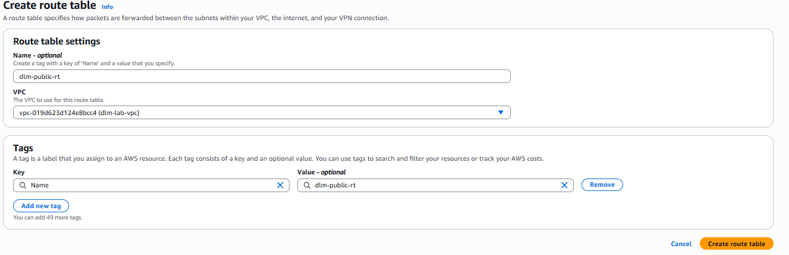
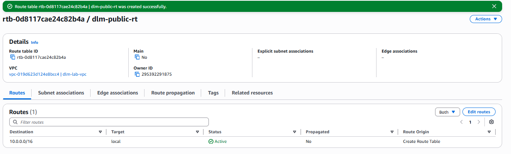

After creating the Route Table, we added a specific routing rule to handle outbound internet traffic:

| Destination | Target | Reason |
| :--- | :--- | :--- |
| `10.0.0.0/16` | `local` | Default rule allowing internal VPC communication. |
| `0.0.0.0/0` | `dlm-lab-igw` | Directs any traffic meant for outside the VPC to the Internet Gateway. |

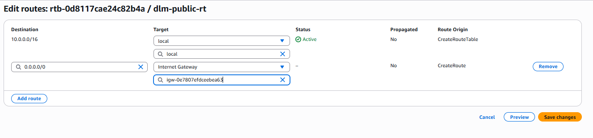
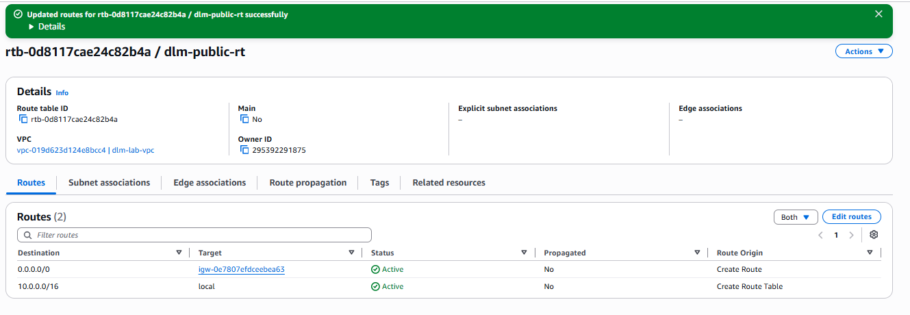

**5. Associate Subnet with Route Table**
To ensure the subnet actually uses the new routing rules, we explicitly associated our `dlm-public-subnet` with the `dlm-public-rt` Route Table. This step is what truly makes the subnet "public".

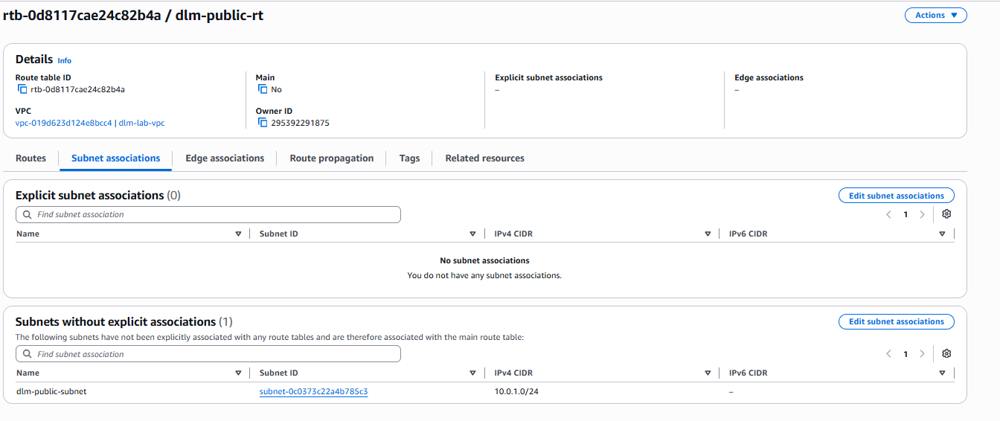
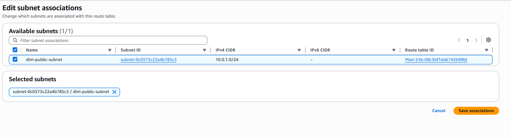
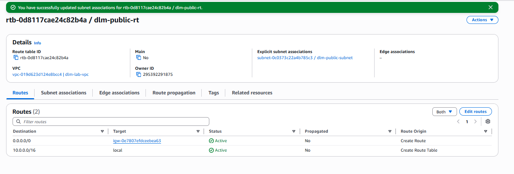

**6. Create Security Group for Web Server**
Created a virtual firewall (`dlm-lab-sg`) to control inbound and outbound traffic for our future EC2 instance. Outbound traffic was left at the default (All traffic).

| Type | Protocol | Port | Source | Reason |
| :--- | :--- | :--- | :--- | :--- |
| **SSH** | TCP | `22` | My IP | Ensures secure terminal access is restricted strictly to your current machine's IP address, rather than exposing it to the entire internet (`0.0.0.0/0`). |
| **HTTP** | TCP | `80` | `0.0.0.0/0` | Allows anyone on the internet to view the web application. |

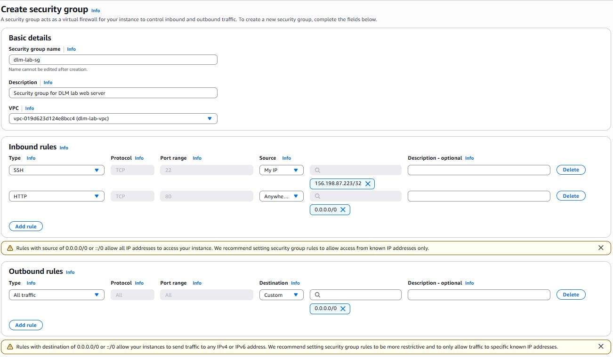
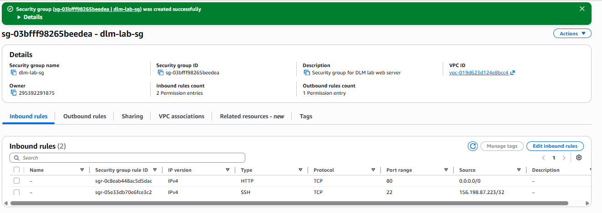

**7. Launch the EC2 Web Server**
Provisioned the actual web server instance. We configured it to be publicly accessible and injected a startup script to automatically install Apache and generate test data.

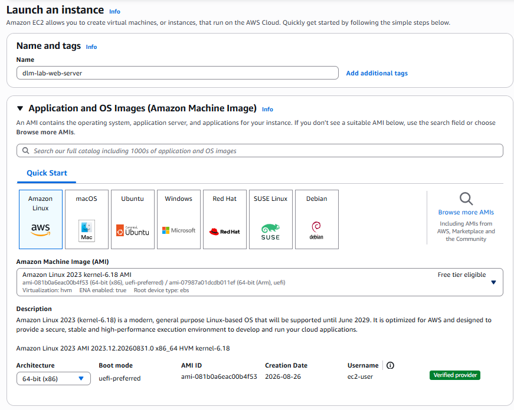
* **Name:** `dlm-lab-web-server` (Identifies the EC2 instance).
* **AMI:** Amazon Linux 2023 (Lightweight, free-tier eligible, and has excellent AWS integration without licensing fees).

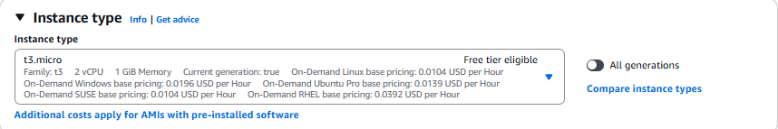
* **Instance Type:** `t3.micro` or `t2.micro` (Smallest free-tier eligible size; perfectly sufficient for a simple Apache server).

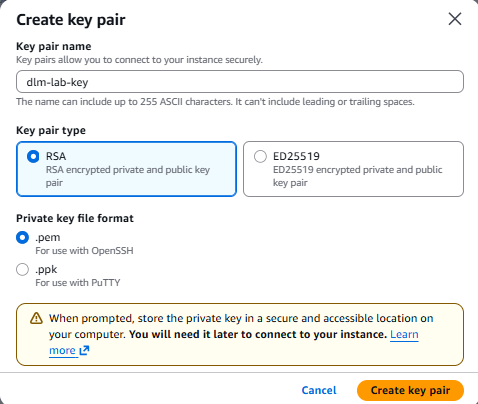
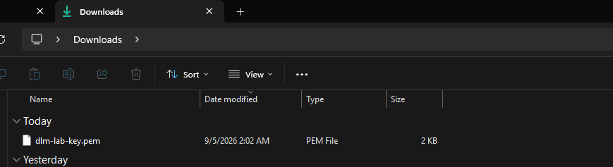
* **Key Pair:** Created and downloaded a new RSA key pair named `dlm-lab-key` securely (`.pem` or `.ppk`) for SSH access if needed.

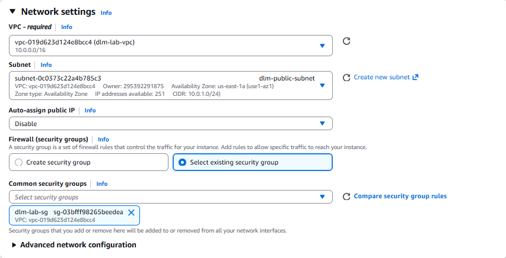
* **VPC & Subnet:** `dlm-lab-vpc` / `dlm-public-subnet` (Places the server in our custom public network).
* **Auto-assign Public IP:** Enable (Required so we can access the web server directly from the internet).
* **Security Group:** Selected the existing `dlm-lab-sg`.

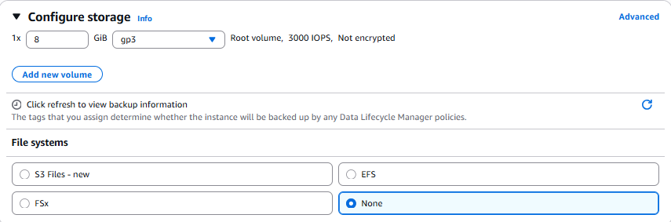
* **Storage:** 8 GiB, `gp3` (Standard general-purpose root volume. `gp3` is cost-effective and performs well for labs).

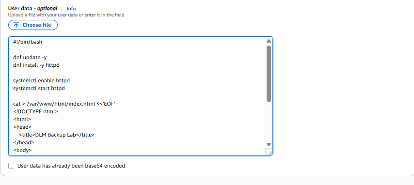
* **Bootstrapping with User Data:** We utilized the Advanced Details **User Data** field to execute a bootstrap script when the instance launches. This automates updating the system, installing Apache (`httpd`), enabling it on boot, starting the service, and creating a custom web page containing a specific **Backup Test ID** (e.g., `DLM-ORIGINAL-001`). This unique ID will be crucial later to prove that our DLM snapshot restore actually worked.

**8. Test the Web Server**
Retrieved the Public IPv4 address of the running EC2 instance and accessed it via a web browser (`http://<PUBLIC-IP>`). This verified that the Apache web server initialized correctly and is successfully serving the custom `index.html` page injected via User Data, proudly displaying our `DLM-ORIGINAL-001` test ID.

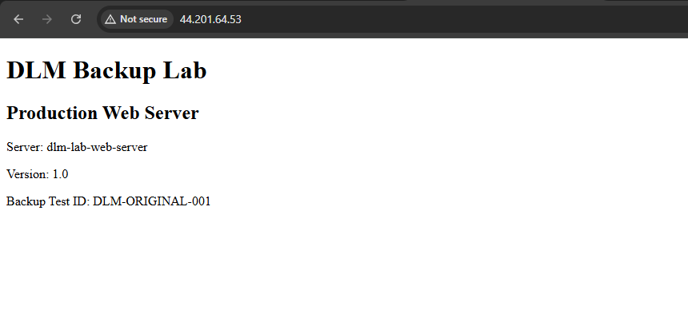

**9. Create a Manual EBS Snapshot**
Before automating our backups, we manually created a point-in-time snapshot of the EC2 instance's EBS volume to establish a baseline. This helps demonstrate how snapshots function as standalone backups prior to applying lifecycle management.

| Setting | Value |
| :--- | :--- |
| **Source Volume** | The underlying EBS Volume attached to our web server |
| **Description** | `Manual baseline snapshot before DLM` |

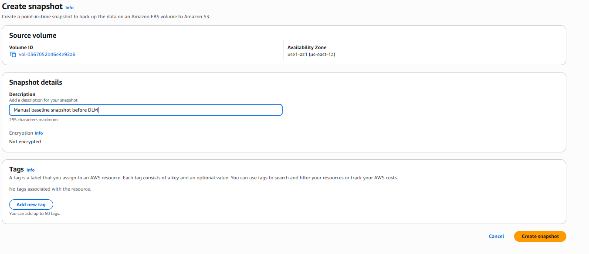

**10. Create an IAM Role for Data Lifecycle Manager (DLM)**
AWS services cannot perform actions on your behalf without explicit permission. To allow DLM to automate snapshot creation, we created a dedicated Identity and Access Management (IAM) Role. 

**Trusted Entity Type (Who or what can assume this role?)**
We must define what entity is allowed to use this role.

| Entity Type | Purpose | Selected |
| :--- | :--- | :--- |
| **AWS service** | Allows internal AWS services (EC2, Lambda, DLM, etc.) to perform actions in this account. | ✅ Yes (Because DLM is an AWS service) |
| **AWS account** | Allows users or roles from another AWS account (yours or a 3rd party) to access resources here. | ❌ No |
| **Web identity** | Used for external web application logins (e.g., Google, Facebook, Amazon Cognito). | ❌ No |
| **SAML 2.0 federation** | Allows users federated from a corporate directory (e.g., Active Directory) to access AWS. | ❌ No |
| **Custom trust policy** | Allows writing a custom JSON policy for complex trust relationships. | ❌ No |

* **Use case:** We specifically selected **Data Lifecycle Manager** to authorize DLM to assume this role.
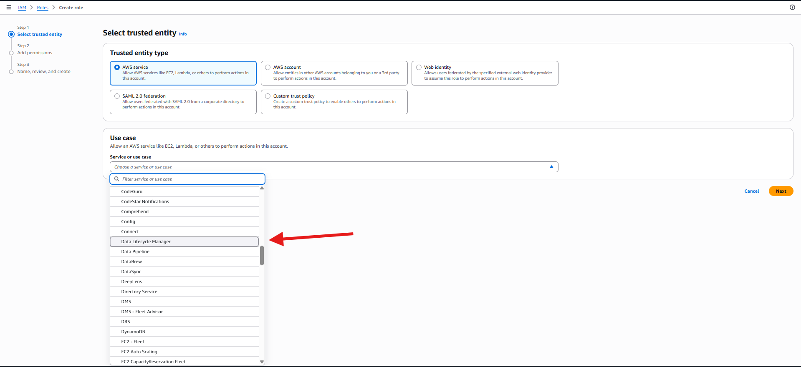

**Add Permissions (What can this role do?)**
Once DLM assumes the role, we need to define its capabilities. 
* We selected the **AWS managed policy** named `AWSDataLifecycleManagerServiceRole`. This policy comes pre-configured by AWS with the exact permissions DLM needs (like creating and deleting EBS snapshots).

**Set Permissions Boundary**
A permissions boundary is an advanced feature used to restrict the maximum possible permissions a role can have.

| Option | Purpose | Selected |
| :--- | :--- | :--- |
| **Create role without a permissions boundary** | The role relies entirely on the attached policies for its permissions. | ✅ Yes |
| **Use a permissions boundary** | Sets a strict, unbreakable maximum limit on permissions, even if attached policies grant more. | ❌ No (Not required for this setup) |

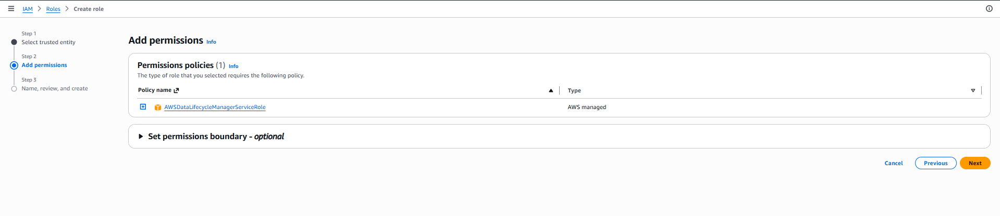
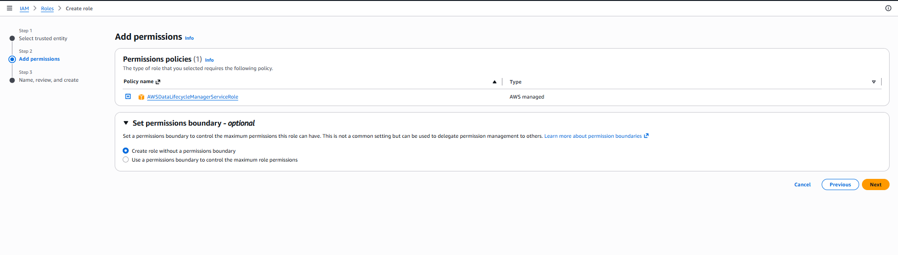

**Name, Review, and Create**
* **Role name:** `dlm-lab-role`
* **Description:** Allow Data Lifecycle Manager to create and manage AWS resources on your behalf.
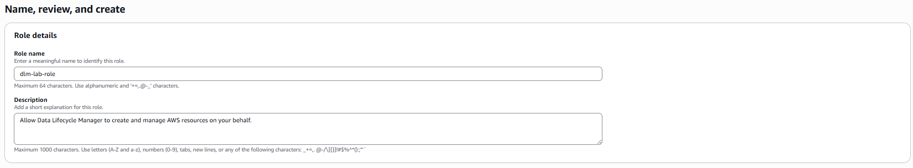
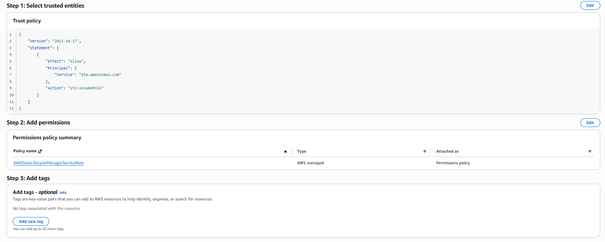

**11. Tag the EBS Volume for DLM Automation**
To tell DLM exactly which volumes to back up, we apply a specific tag to our EC2 instance's root volume. 

* Navigated to EC2 -> Volumes, selected our web server's root volume, and opened the **Tags** tab.
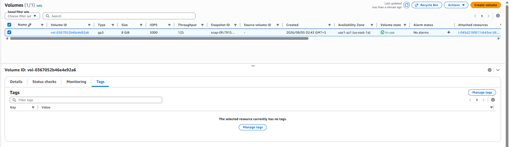
* Clicked **Manage tags** and added a new key-value pair:
  * **Key:** `Backup`
  * **Value:** `DLM`
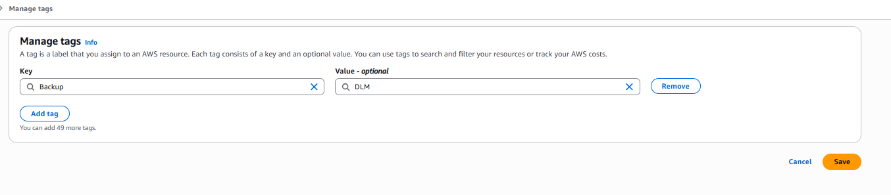

*Reasoning:* DLM policies use resource tags to identify targets. Instead of manually linking a policy to individual volumes, the policy will automatically search the environment and back up any volume that has the `Backup=DLM` tag. This makes the backup strategy highly scalable.

**12. Create DLM Lifecycle Policy: Schedule & Settings**
We navigated to EC2 -> Lifecycle Manager to create a new policy. A DLM policy acts as an automated backup plan, targeting resources based on tags and running according to a defined schedule.

**Schedule Configuration:**
We named the schedule `DLM-Backup-Schedule` (best practice for production over the default "Schedule 1"). AWS DLM supports various execution frequencies. For this lab, we selected **Daily (Every 12 Hours)** starting at `09:00 UTC` to observe the lifecycle in action quickly.

| Frequency Options | Description | Visual Reference |
| :--- | :--- | :--- |
| **Daily** | Runs every 1, 2, 3, 4, 6, 8, 12, or 24 hours. | 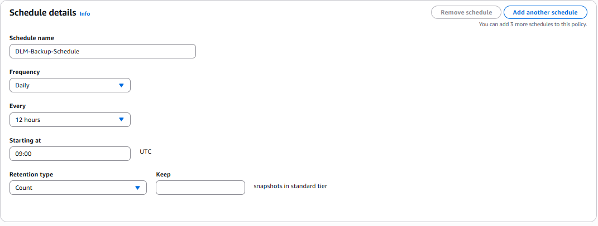 |
| **Weekly** | Runs on specific days of the week. | 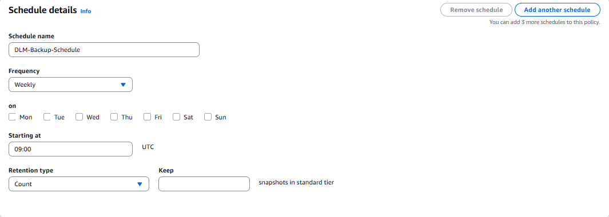 |
| **Monthly** | Runs on a specific day of the month. | 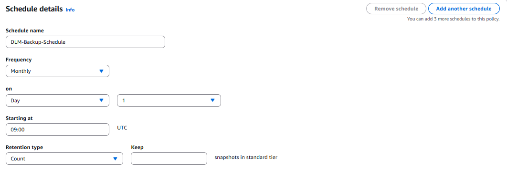 |
| **Yearly** | Runs in a specific month/day of the year. | 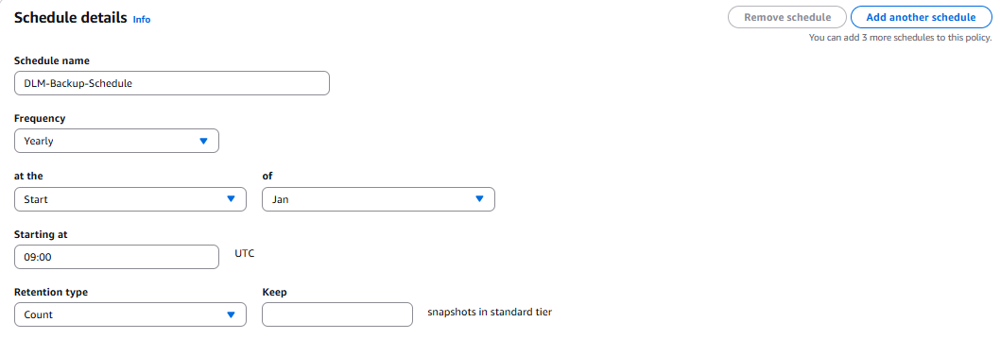 |
| **Custom cron** | Advanced scheduling using standard cron expressions. | 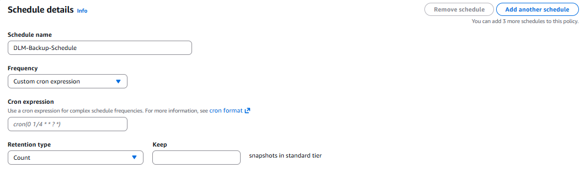 |

**Retention Rules:**
Retention determines how long backups are kept before being automatically deleted. AWS offers two types. For this lab, we used **Count** and set it to **Keep 3**, meaning DLM will only retain the 3 most recent snapshots to save costs.

| Retention Type | Description | Visual Reference |
| :--- | :--- | :--- |
| **Count** | Retains a specific *number* of recent snapshots. | (Selected for lab) |
| **Age** | Retains snapshots based on *time* (e.g., keep for 30 days). | 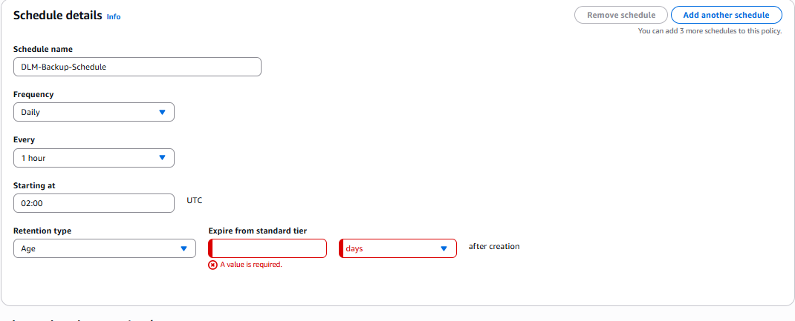 |

**Advanced Settings:**
Below the schedule, DLM offers advanced configurations for the generated snapshots.

| Advanced Setting | Configuration | Reason | Visual Reference |
| :--- | :--- | :--- | :--- |
| **Tagging** | Add `CreatedBy=DLM` | Differentiates the tag used to *find* the volume from the tag *applied* to the resulting snapshot. | 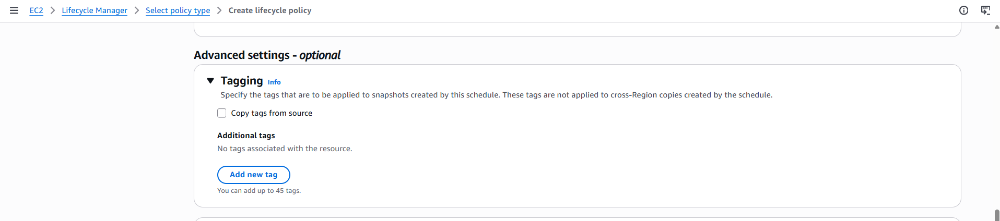 |
| **Snapshot archiving** | Disabled ❌ | Archiving is for long-term storage. AWS restricts this to monthly/yearly schedules or crons ≥ 28 days. | 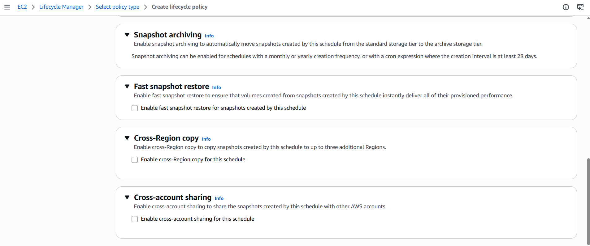 |
| **Fast snapshot restore** | Disabled ❌ | Accelerates performance restoration in specific AZs but incurs significant hourly costs. |  |
| **Cross-Region copy** | (Pending configuration) | We will configure this critical Disaster Recovery feature in the next step before creating the policy. |  |

## ⚠️ Key Notes
* **VPC Isolation & Public Subnets:** A newly created VPC is completely isolated. Furthermore, naming a subnet "Public" does not make it public. A subnet is only truly public when it is explicitly associated with a Route Table that has a route (`0.0.0.0/0`) pointing to an attached Internet Gateway.
* **Storage Hierarchy (EBS vs. Snapshot vs. DLM):** It is critical to understand the distinction between these components:
  * **EBS Volume:** The live block storage acting as the hard drive for the EC2 instance.
  * **Snapshot:** A static, point-in-time backup of the EBS volume data.
  * **DLM:** The automation engine that manages the scheduling, creation, and retention lifecycles of these snapshots.
* **DLM Execution Window (UTC):** The `Starting at` time is strictly in **UTC**, not local time. Furthermore, DLM does not guarantee execution at the exact minute specified; the snapshot process will initiate within a **one-hour window** following the scheduled time.

## ✅ Outcome
*(Waiting for lab completion...)*