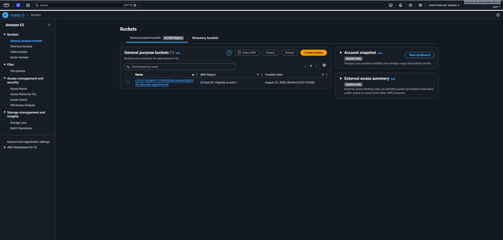
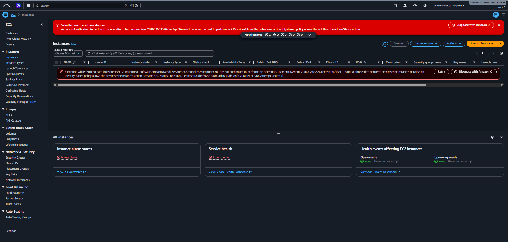
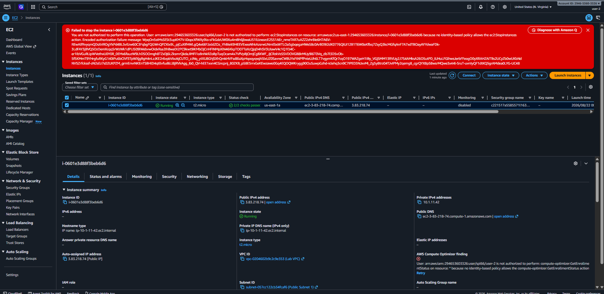
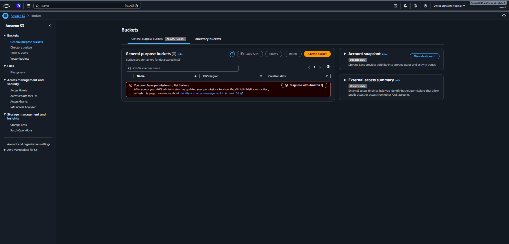
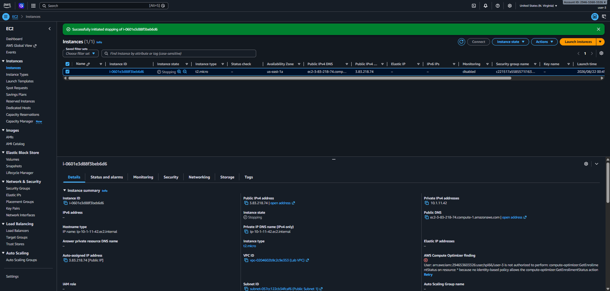

# ☁️ AWS IAM: Role-Based Access Control (RBAC) Implementation

A hands-on project demonstrating the **Principle of Least Privilege** in AWS. This lab configures secure, job-specific access for cloud support staff using IAM users, groups, and policies.

## 🧰 Services Used
- **AWS IAM** (Identity and Access Management)
- **Amazon EC2** (Elastic Compute Cloud)
- **Amazon S3** (Simple Storage Service)

## 🪜 Task 1: Explore the users and groups, and inspect policies

* **👤 IAM Users**  
We have 3 users (`user-1`, `user-2`, `user-3`) already created for us, but they currently have no permissions or group memberships yet.  

* **👤IAM Users Groups & Policies**   
We found 3 groups, each with different permissions. Here is a breakdown of what each group does:

| Group Name | Permission Type | Description | JSON Policy |
| :--- | :--- | :--- | :--- |
| **EC2-Support** | Managed Policy | **Read-Only:** Allows viewing EC2 (including VPC security groups), Load Balancing, CloudWatch (metrics and statistics), and Auto Scaling resources. | 

<strong>Show Policy</strong>
<pre><code>{   "Version": "2012-10-17",   "Statement": [     { "Effect": "Allow", "Action": [ "ec2:Describe*", "ec2:GetSecurityGroupsForVpc" ], "Resource": "*" },     { "Effect": "Allow", "Action": "elasticloadbalancing:Describe*", "Resource": "*" },     { "Effect": "Allow", "Action": [ "cloudwatch:ListMetrics", "cloudwatch:GetMetricStatistics", "cloudwatch:Describe*" ], "Resource": "*" },     { "Effect": "Allow", "Action": "autoscaling:Describe*", "Resource": "*" }   ] }</code></pre>
 |
| **S3-Support** | Managed Policy | **Read-Only:** Allows getting, listing, and describing resources in Amazon S3, including S3 Object Lambda. | 

<strong>Show Policy</strong>
<pre><code>{   "Version": "2012-10-17",   "Statement": [     { "Effect": "Allow", "Action": [ "s3:Get*", "s3:List*", "s3:Describe*", "s3-object-lambda:Get*", "s3-object-lambda:List*" ], "Resource": "*" }   ] }</code></pre>
 |
| **EC2-Admin** | Inline Policy | **Admin/Custom:** Allows viewing, starting, and stopping EC2 instances, but **strictly limited** to `*.nano` and `*.micro` instance types. | 

<strong>Show Policy</strong>
<pre><code>{   "Version": "2012-10-17",   "Statement": [     { "Condition": { "ForAllValues:StringLikeIfExists": { "ec2:InstanceType": [ "*.nano", "*.micro" ] } }, "Action": [ "ec2:Describe*", "ec2:StartInstances", "ec2:StopInstances" ], "Resource": [ "*" ], "Effect": "Allow" }   ] }</code></pre>
 |

* **🎯 The Target Mapping & Final Goal**

| User | Target Group | Job Function & Permissions |
| :--- | :--- | :--- |
| 👤 **user-1** | 🪣 **S3-Support** | Read-only access to Amazon S3 |
| 👤 **user-2** | ☁️ **EC2-Support** | Read-only access to Amazon EC2 |
| 👤 **user-3** | 🛠️ **EC2-Admin** | View, Start, and Stop Amazon EC2 instances (nano/micro only) |

## 🪜Task 2: Add users to groups

  

* **Adding user-1:**  
  `IAM Dashboard` ➡️ `User groups` ➡️ `S3-Support` ➡️ `Users tab` ➡️ `Add users` ➡️ `Select user-1` ➡️ `Add users`

* **Adding user-2:**  
  `IAM Dashboard` ➡️ `User groups` ➡️ `EC2-Support` ➡️ `Users tab` ➡️ `Add users` ➡️ `Select user-2` ➡️ `Add users`

* **Adding user-3:**  
  `IAM Dashboard` ➡️ `User groups` ➡️ `EC2-Admin` ➡️ `Users tab` ➡️ `Add users` ➡️ `Select user-3` ➡️ `Add users`

## 🪜Task 3: Sign in and test user permissions

* 👤 **Testing `user-1` (S3-Support):**
  * 🪣 **S3 Access:** ✅ Successfully viewed S3 buckets and their contents.
     
  * ☁️ **EC2 Access:** ❌ Received an *Unauthorized* error when trying to view instances.
     

* 👤 **Testing `user-2` (EC2-Support):**
  * ☁️ **EC2 Access (View):** ✅ Successfully listed and viewed EC2 instances.
    
  * 🛑 **EC2 Access (Modify):** ❌ Received an *Unauthorized* error when attempting to **Stop** an instance.
     
  * 🪣 **S3 Access:** ❌ Received an *Unauthorized* error when trying to list buckets.
     

* 👤 **Testing `user-3` (EC2-Admin):**
  * ☁️ **EC2 Access (View):** ✅ Successfully listed and viewed EC2 instances.
    
  * 🛑 **EC2 Access (Modify):** ✅ Successfully **Stopped** the EC2 instance (Instance state changed to *Stopping*).
     