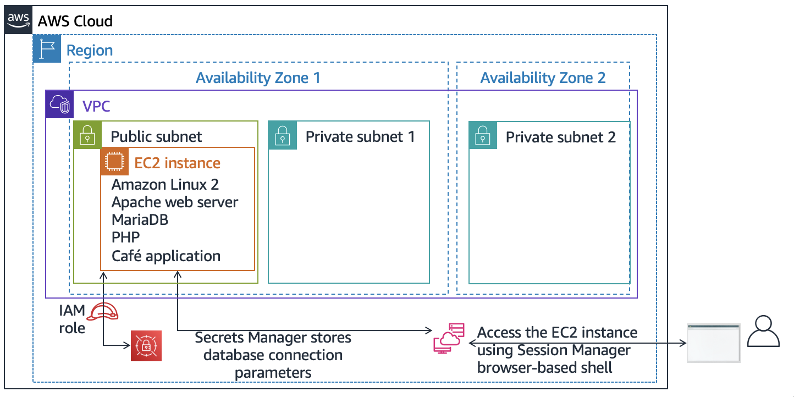
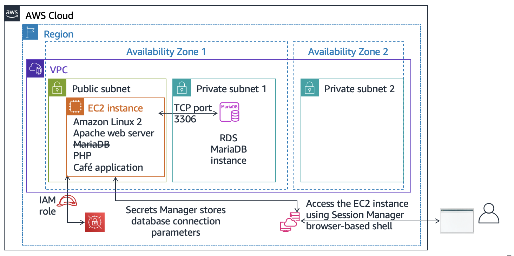
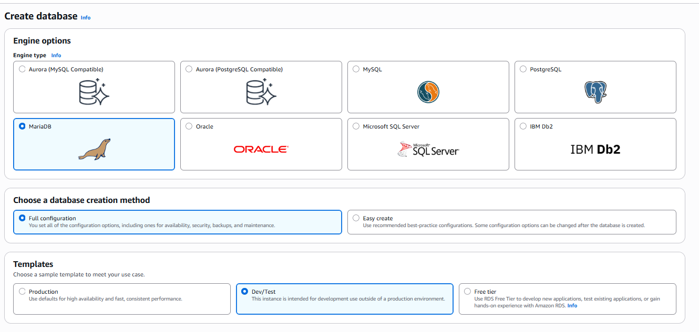

# 🚀 AWS Database Migration: EC2 to Amazon RDS

Migrating a local MariaDB database running on a single EC2 instance to a fully managed Amazon RDS database. This migration improves scalability, simplifies maintenance, and automates backups without altering a single line of application code.

## 🎯 Objective
* 🛠️ **Provision:** Create a managed Amazon RDS MariaDB instance.
* 🕵️ **Analyze:** Access the existing EC2 web app and database securely using AWS Systems Manager.
* 📦 **Export:** Backup local data from EC2 using `mysqldump`.
* 🔌 **Network Security:** Configure Security Groups to allow database traffic from EC2 to RDS.
* 📥 **Migrate:** Import the exported data into the new RDS instance.
* 🔄 **Cutover:** Update app secrets in AWS Secrets Manager and disable the old local database.

## 🧰 Services Used
* 💻 **Amazon EC2** — Hosts the Café web application.
* 🗄️ **Amazon RDS** — Fully managed relational database service.
* 🔐 **AWS Secrets Manager** — Securely stores and manages database connection credentials.
* ⚙️ **AWS Systems Manager (SSM)** — Provides secure, keyless terminal access to the EC2 instance.

---

## 🏗️ Architecture

**Before Migration (Local Database):**
The web server and the database were running on the same EC2 instance, causing heavy resource usage and manual maintenance overhead.

**After Migration (Managed Database):**
The database is offloaded to Amazon RDS in a private subnet, allowing the EC2 instance to solely focus on web hosting while RDS handles database management, patching, and backups.

---

## 🪜 Steps

### 🛠️ 1. Create the Amazon RDS Instance
*The Café's database is currently running locally on EC2, causing maintenance headaches. To fix this, our first step is to spin up a fully managed RDS instance to act as our new database backend.*

We configured the RDS instance to match the application's existing engine while keeping costs low and security high.

| Setting | Value | Reason |
| :--- | :--- | :--- |
| **Engine** | MariaDB `10.6.25` | Matches the existing app's engine to avoid compatibility issues. |
| **Template** | Dev/Test | Provides a cost-effective environment for testing. |
| **Credentials** | `admin` / `Caf3DbPassw0rd!` | Secure access credentials for the master user. |
| **Instance Class**| `db.t3.micro` | Burstable, lightweight compute suitable for this lab. |
| **Storage** | `gp2` (20 GiB) | General Purpose SSD for balanced performance. |
| **Network** | `Lab VPC` / `lab-db-subnet-group` | Places the DB in our predefined lab network. |
| **Public Access** | `No` | Security best practice: the DB should not be reachable from the internet. |
| **Security Group**| `dbSG` | Attaches a pre-configured firewall for the database layer. |

*The database creation process takes a few minutes to complete.*

### 🕵️ 2. Analyze the Existing Application & Connect to EC2
*While the new RDS instance provisions in the background, we must confirm the current live app is working. Once verified, we need a secure way to access the server's backend to prepare for the data extraction.*

1.  **Tested the Web App:** Accessed the EC2 Public IP, placed an order, and checked the "Order History" to ensure data was being written successfully to the old local database.
    
    
2.  **Connected via SSM:** Instead of managing SSH keys, we used AWS Systems Manager (Session Manager) to securely connect to the EC2 terminal directly from the AWS Console browser. Once inside, we switched to the `ec2-user`.
    
    

### 🔑 3. Retrieve Credentials from Secrets Manager
*To export the local data, we need the local database password. Since the web application doesn't hardcode passwords, we must fetch it securely from AWS Secrets Manager.*

*   Navigated to AWS Secrets Manager and opened the `/cafe/dbPassword` secret.
*   Retrieved the value (`Re:Start!9`) to use in our terminal commands for the next step.
    

### 📦 4. Export Data from the Local EC2 Database
*Now that we have the password and terminal access, we can safely extract the café's historical orders from the local MariaDB into a portable SQL dump file.*

*   Logged into the local database using `mysql -u root -p` and the password retrieved earlier.
*   Explored the `cafe_db` to verify the `order` and `order_item` tables were intact.
*   Ran the `mysqldump` utility to package the entire database into a backup file named `CafeDbDump.sql`.

### 🛡️ 5. Configure Security Group for RDS Connection
*We have our exported data ready, but the new RDS instance is completely locked down by default. To allow our EC2 instance to push data to it, we must open the MySQL port (3306) specifically for the EC2's security group.*

1.  Confirmed the new RDS instance status had changed to **Available** and noted its endpoint URL.
    
    
2.  Edited the Inbound Rules of `dbSG` (the RDS security group).
3.  Added a rule for **MySQL/Aurora (TCP 3306)** and set the source directly to the Security Group ID of the EC2 instance. This creates a secure, trusted network path between the two resources.
    

### 📥 6. Import Data into the New RDS Instance
*With the secure network path open, it's time to populate our empty managed RDS database by importing the SQL dump file we created in Step 4.*

*   From the EC2 terminal, we pushed the data to the new DB: `mysql -u admin -p --host <rds-endpoint> < CafeDbDump.sql`
*   Logged into the RDS instance to verify the import. Ran `show databases;`, `use cafe_db;`, and `select * from order;` to confirm all 24+ historical orders were successfully transferred!

### 🔄 7. Application Cutover (Update Secrets)
*The RDS database is now fully loaded, but the web app is still talking to the old local database. To finalize the migration, we need to update the application's compass by changing the connection strings in Secrets Manager. No application code needs to be rewritten!*

We updated the following secrets:
*   **`/cafe/dbUrl`**: Replaced `localhost` with the new **RDS Endpoint URL**.
    
*   **`/cafe/dbUser`**: Changed the database user to `admin`.
    
*   **`/cafe/dbPassword`**: Changed the password to our new RDS password (`Caf3DbPassw0rd!`).
    

### 🛑 8. Stop Local DB and Final Verification
*The final test: To prove the app is truly using the new RDS database, we will shut down the old local database entirely and try placing an order.*

1.  Ran `sudo service mariadb stop` in the EC2 terminal.
2.  Refreshed the café website. The menu loaded successfully, proving it's no longer relying on the local DB!
    
3.  Placed a new order and checked the "Order History". The new order appeared seamlessly right alongside the old, migrated historical orders.
    

---

## ⚠️ Key Notes
* 🔐 **Security Group Chaining:** Opening a port to `0.0.0.0/0` for a database is highly insecure. We chained security groups by allowing traffic *only* from the specific Security Group ID of our web tier, ensuring maximum isolation.
* 🤫 **Decoupling with Secrets Manager:** Because the application was designed to fetch DB credentials dynamically from AWS Secrets Manager, we completely migrated the database backend without modifying or redeploying a single line of PHP code.

## ✅ Outcome
The café's database was successfully migrated from a self-managed EC2 local installation to **Amazon RDS**. The application is now securely connected to a highly durable, managed database system. This transition eliminates manual database patching, automates backups, and paves the way for easier future scaling, all with zero application downtime or code changes.