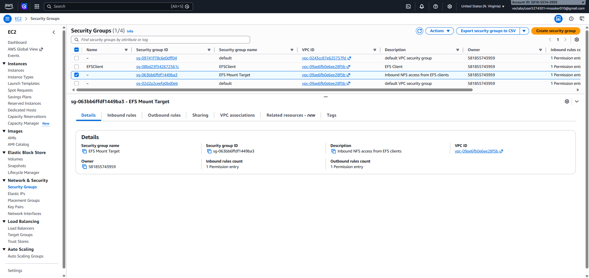
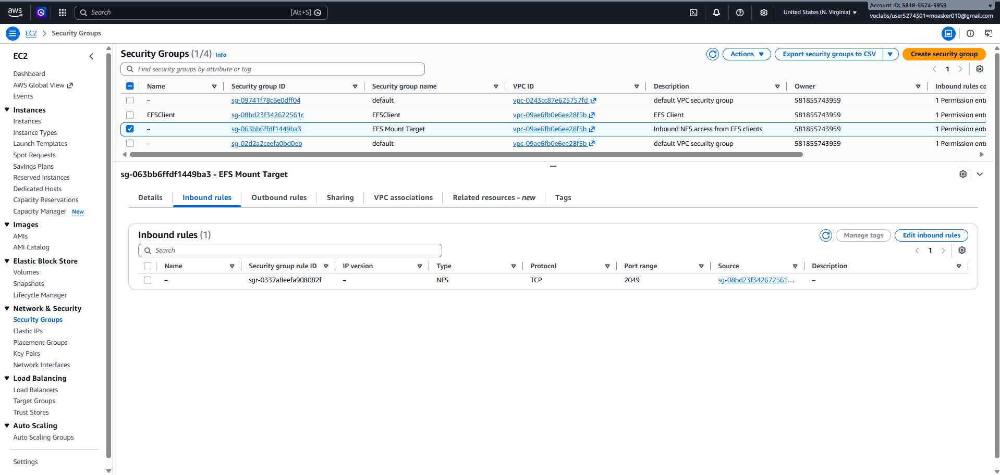
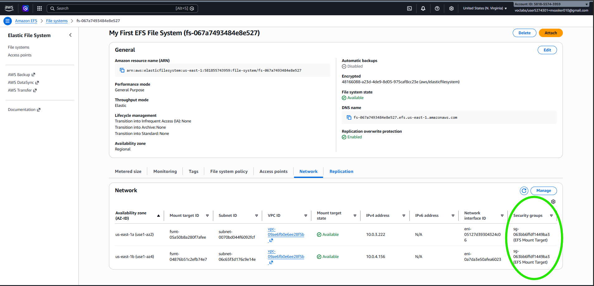
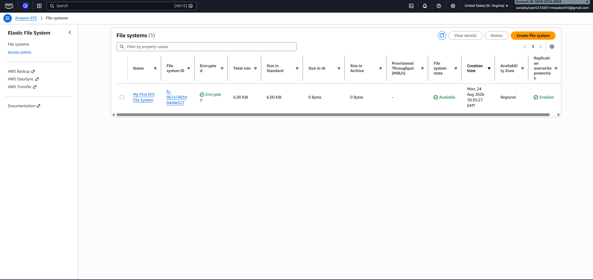

# 📂 AWS EFS: Introducing Amazon Elastic File System

A guided lab focused on creating, mounting, and monitoring an Amazon Elastic File System (EFS) on an Amazon EC2 instance.

## 🎯 Objective
* 🔑 Log in to the AWS Management Console.
* 📁 Create an Amazon EFS file system.
* 🖥️ Log in to an Amazon EC2 instance running Amazon Linux.
* 🔗 Mount the file system to the EC2 instance.
* 📊 Examine and monitor the performance of the file system.

## 🧰 Services Used
* 📁 **Amazon EFS**
* 🖥️ **Amazon EC2**
* 🔐 **Amazon VPC (Security Groups)**
* 📈 **Amazon CloudWatch**

## 🪜 Steps

**1. Create a Security Group for EFS Access**
Created a new security group to securely control inbound traffic to the EFS file system.
* 🛡️ **Security Group Creation:** Created a group named `EFS Mount Target` within the `Lab VPC`.
* 🚦 **Inbound Rules Configuration:** Added a rule to allow inbound Network File System (NFS) traffic on TCP port 2049 strictly from the `EFSClient` security group.
  * 💡 **Why?** This acts as a virtual firewall, ensuring that only authorized EC2 instances can mount and access the EFS file system.

**2. Create an EFS File System**
Created and customized an Amazon EFS file system to be accessible across multiple Availability Zones using standard NFSv4.1.
* ⚙️ **Configuration:** Disabled automatic backups, set transition lifecycle management to *None*, and tagged the system with the Name `My First EFS File System`.
* 🌐 **Network Settings:** Deployed the file system within the `Lab VPC`. Removed the `default` security group from all Availability Zone mount targets and attached the newly created `EFS Mount Target` security group instead.

* ✅ **Outcome:** Successfully created the file system and verified the File System state and Mount Target states became **Available**.

**3. Mount the EFS File System**
Installed the necessary utilities on the EC2 instance and mounted the EFS file system using the NFSv4.1 protocol.
* 📦 **Install Utilities & Create Directory:** Installed the `amazon-efs-utils` package and created a local mount point directory named `efs`.
* 🔗 **Retrieve & Execute Mount Command:** Opened the EFS Console, clicked **Attach**, copied the provided NFS client mount command, and executed it in the EC2 terminal.

* 🚀 **Verify:** Checked the disk filesystem usage with `sudo df -hT` to confirm the 8.0E volume was mounted successfully.

**4. Examine File System Performance**
Benchmarked the file system's write performance using the `fio` utility and monitored the throughput behavior using Amazon CloudWatch.
* 🏋️ **Benchmarking with Flexible IO (`fio`):** Executed a synthetic I/O benchmarking test on the EC2 instance to simulate a heavy, continuous 10 GB write workload.

* 📈 **Monitoring Permitted Throughput:** Checked the `PermittedThroughput` metric in CloudWatch. The peak capability was around 3 GB/s, proving EFS automatically bursts to accommodate spiky workloads.

* 📊 **Calculating Actual Write Throughput:** Switched to the `DataWriteIOBytes` metric (Sum, 1 Minute). The peak was ~7.6 GB/min, which translates to the actual B/s throughput, demonstrating linear performance scaling.

## ⚠️ Key Notes
* EFS file systems scale their permitted throughput linearly as the amount of stored data grows.
* The service is designed to automatically burst to high throughput levels to handle sudden spiky workloads.

## ✅ Outcome
Successfully deployed, secured, mounted, and stress-tested a highly available Amazon EFS file system, verifying its burst and scaling capabilities via CloudWatch.