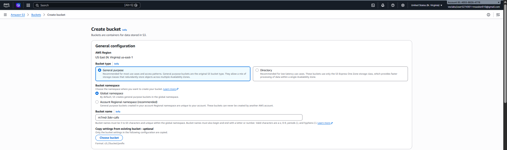
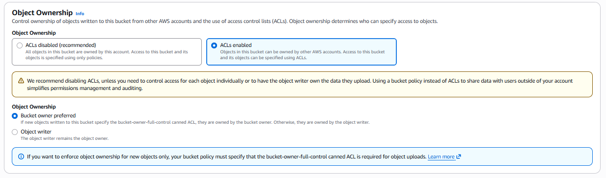
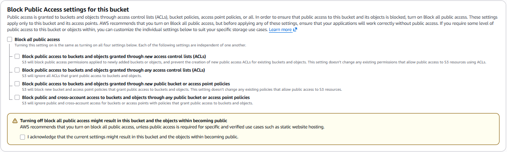
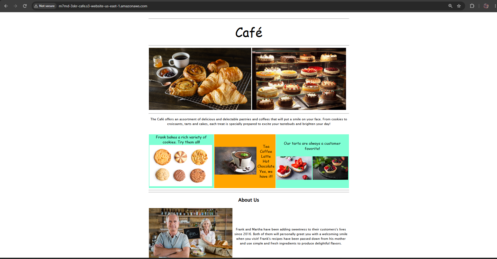
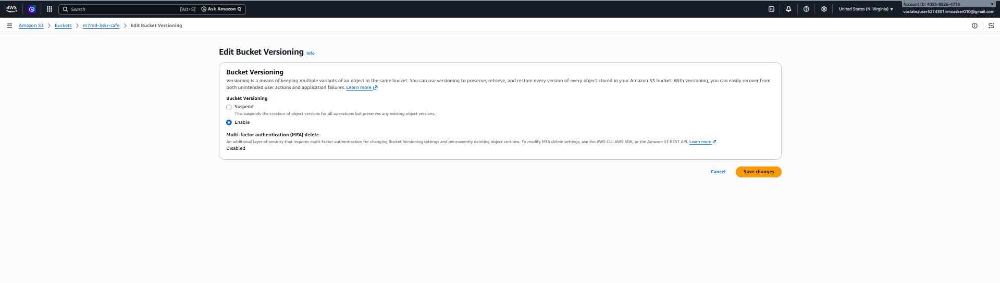
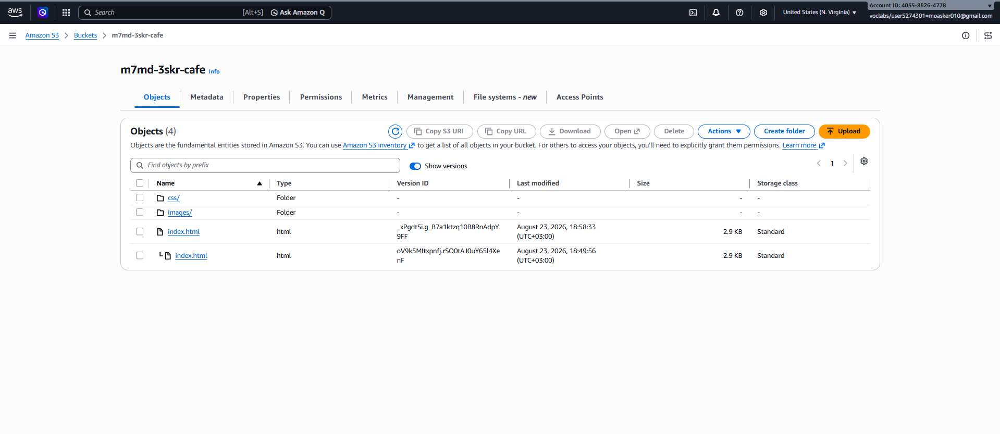
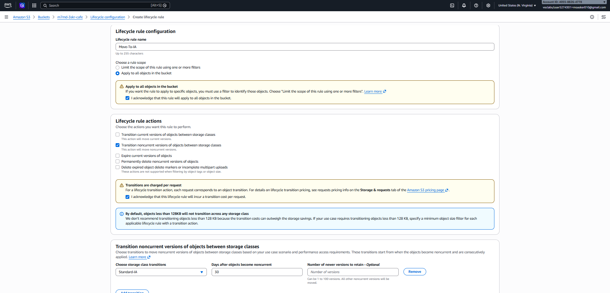
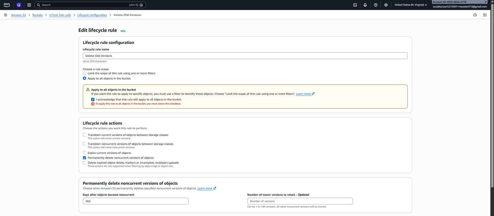

# ☕ AWS S3: Café Static Website & Data Management

A challenge lab focused on hosting a static website on Amazon S3 while implementing architectural best practices for data protection and management.

## 🎯 Objective
* 🌐 Host a **Static Website** using Amazon S3.
* 🔒 Implement **Data Protection** mechanisms.
* ♻️ Configure a **Data Lifecycle Strategy**.
* 🚑 Establish a **Disaster Recovery (DR)** strategy.

## 🧰 Services Used
* 🪣 **Amazon S3**

## 🪜 Task 1: Extract Website Files
📦 Extracted the provided lab `.zip` file containing the café's website assets (`index.html`, `css`, and `images`).

## 🪜 Task 2: Create & Configure S3 Bucket
Created a new S3 bucket to act as a public web server and configured its access permissions.

* 🪣 **Bucket Creation:** Created a general-purpose bucket.
  * 💡 **Why?** The chosen name must be **globally unique** because it acts as the foundation for the website's public URL.
  <br>

* 🔑 **Object Ownership:** Enabled **ACLs** (Access Control Lists).
  * 💡 **Why?** To allow granting public read access to individual files inside the bucket.
  <br>

* 🌍 **Public Access:** Disabled **Block all public access**.
  * 💡 **Why?** Because a website must be publicly reachable over the internet to serve visitors.
  <br>

* ⚙️ **Website Hosting:** Configured the bucket for static hosting and defined `index.html` as the default **Index document**.
  * 💡 **Why?** This tells S3 which file to load by default when a user visits the root website link.
  <br>

## 🪜 Task 3: Upload Content & Test
Uploaded the website files to the bucket and tested the public access.

* 📤 **Uploading Files:** Uploaded the extracted `index.html` file, along with the `css` and `images` folders, directly into the S3 bucket.
  <br>

* 🧪 **Testing Access:** Opened the **S3 website endpoint URL** in a browser. 
  * ⚠️ **Outcome:** A **403 Forbidden (Access Denied)** error appeared. 
  * 💡 **Why?** This is expected behavior. Although the bucket is open to the public, the individual uploaded files (objects) themselves do not yet have public read permissions enabled via ACLs.
  <br>

  

 ## 🪜 Task 4: Grant Public Access via Bucket Policy
Resolved the 403 Forbidden error by automating public read access for all current and future website files.

* 📜 **Bucket Policy:** Applied a JSON bucket policy to grant `s3:GetObject` permissions to all anonymous users (`*`).
  * 💡 **Why?** To automatically make all uploaded objects publicly readable, eliminating manual permission updates for new files.
  
  <details><summary><strong>View Bucket Policy JSON</strong></summary>
  
  ```json
  {
    "Version": "2012-10-17",
    "Statement": [
      {
        "Effect": "Allow",
        "Principal": "*",
        "Action": "s3:GetObject",
        "Resource": "arn:aws:s3:::m7md-3skr-cafe/*"
      }
    ]
  }

* 🌐 **Verification:** Reloaded the S3 website endpoint URL in the browser.
  * ✅ **Outcome:** Success! The static website loaded perfectly, displaying all HTML and image content.
  <br>

---

## 🪜 Task 5: Enable Object Versioning
Implemented S3 Object Versioning to protect website data from accidental overwrites or deletions.

* ⚙️ **Bucket Configuration:** Enabled **Bucket Versioning** in the S3 bucket properties.
  * 💡 **Why?** To keep multiple variants of an object in the same bucket. This ensures that if a file is modified or deleted, the previous versions can still be recovered. *(Note: Once enabled, versioning can only be suspended, never fully disabled).*
  <br>

* 📝 **Updating Website Content:** Modified the local `index.html` file by changing the embedded CSS background colors (e.g., changing `aquamarine` to `gainsboro` and `orange` to `cornsilk`).

* 📤 **Uploading New Version:** Uploaded the updated `index.html` file to the S3 bucket and reloaded the website in the browser to confirm the visual changes.

* 🔄 **Verifying Versions:** Navigated to the S3 bucket objects and clicked **Show versions**.
  * ✅ **Outcome:** Both the original and the newly updated versions of the `index.html` file were listed, confirming that S3 successfully preserved the old data.
  <br>


  ---


## 🪜 Task 6: Set Lifecycle Policies
Implemented the architectural best practice of data lifecycle management to automate cost savings based on the AWS Well-Architected Framework.

* ♻️ **Lifecycle Rule 1 (Transition):** Configured a rule to move *previous versions* of objects to the **S3 Standard-Infrequent Access (S3 Standard-IA)** storage class after **30 days**.
  * 💡 **Why?** To reduce storage costs for older versions that are rarely accessed but still need to be kept just in case.
  <br>

* 🗑️ **Lifecycle Rule 2 (Expiration):** Configured a second separate rule to permanently delete *previous versions* of objects after **365 days**.
  * 💡 **Why?** To automatically clean up and destroy old data that is no longer required, preventing indefinite storage growth.
  <br>

---

## 🪜 Task 7: Enable Cross-Region Replication (CRR)
Implemented automated disaster recovery (DR) by replicating data to a secondary AWS Region.

* 🪣 **Destination Bucket Creation:** Created a new backup bucket (`m7md-3skr-cafebackup`) in a different AWS Region (`us-east-2` Ohio) and enabled Versioning.
  * 💡 **Why?** CRR requires both the source and destination buckets to have versioning enabled.
  <br>
  <br>

* 🔄 **Replication Rule Configuration:** Created the `cafe-replication` rule on the source bucket.
  * **Scope:** Applied the rule to replicate the entire bucket.
  * **IAM Role:** Assigned the `CafeRole` to grant S3 permissions to read from the source and replicate to the destination.
  <br>
  <br>

* 🧪 **Testing Replication (Source):** Uploaded a new modification to `index.html` in the source bucket.
  * ✅ **Outcome:** The source bucket successfully logged all three versions of the file.
  <br>

* 🧪 **Testing Replication (Destination):** Checked the backup bucket in the Ohio region.
  * ✅ **Outcome:** The new object was successfully replicated to the destination bucket automatically.
  <br>

* 🗑️ **Deletion DR Test:** Deleted the latest version from the source bucket.
  * 💡 **Observation:** Deleting a version in the source bucket does *not* delete it from the destination bucket, preventing accidental or malicious total data loss.